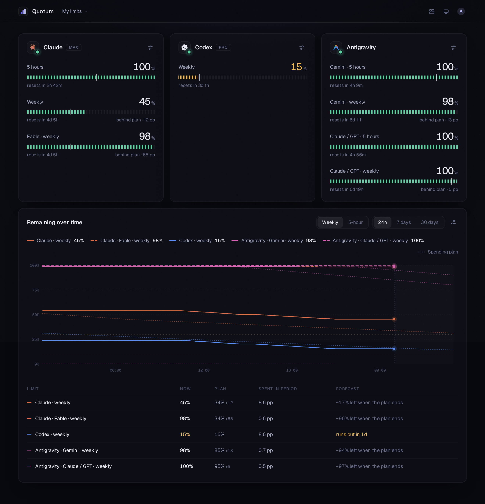

# Quotum

**English** · [Русский](README.ru.md)

[](https://github.com/padurets/quotum/releases/latest)
[](https://www.npmjs.com/package/quotum)
[](https://github.com/padurets/quotum/actions/workflows/ci.yml)
[](LICENSE)

Quotum shows how much of your coding-agent subscriptions is left — Claude Code, Codex
and Antigravity — on every machine you work on, in one place: for you alone or for a
whole team. You host it yourself, and it never touches your provider tokens.



**Quick start**

```sh
# The hub; `docker logs quotum` shows the setup code of the first account
docker run -d --name quotum -p 8080:8080 -v quotum:/data ghcr.io/padurets/quotum-hub

# On every machine: confirm the code in the browser, then keep measuring in the background
npx quotum connect http://<the hub>:8080
npx quotum start
```

`npx quotum` alone prints this machine's limits without any hub. More in
[Getting started](#getting-started).

## Why I made it

I pay for several coding agents at once, and each has its own limits: a five-hour
window, a weekly one, sometimes a separate weekly window for a particular model. To know
where I stood I had to open each tool, type `/usage` and do the maths in my head: at
this pace, will the weekly limit last until the weekend? On top of that I don't work on
one machine. There is a laptop, a few remote dev environments and some containers, and
the same subscriptions are signed in on several of them.

I wanted one page that answers the questions I actually have:

- how much is left in each window, and when does it reset;
- am I spending faster than I planned for this week;
- what did the last few days look like.

I looked around first. What I found either lives on a single machine (the dashboard
started out reading from [CodexBar](https://github.com/steipete/CodexBar), a nice macOS
menu-bar app), or wants your provider tokens or browser cookies so it can call the
providers' APIs for you. The first didn't match how I work, and I didn't want to do the
second. So I wrote Quotum.

## How it works

There are two parts:

- **The agent** is a small native program (Rust, a single binary of about 3 MB). It
  runs on each machine where you use coding agents and asks their own command-line
  clients for the limits, the same numbers you see when you type `/usage`. It doesn't
  read tokens, make model requests or call provider APIs itself: the client does
  exactly what it does when you use it.
- **The hub** is a small web service (Node.js and SQLite) with the dashboard. Agents
  send it what they measured; it keeps the history and draws it.

```
 laptop ──┐
 dev VM ──┼── quotum agent ── HTTPS ──►  hub  ──►  dashboard
 box    ──┘   claude · codex · agy       SQLite
```

If one subscription is signed in on several machines, they don't all measure it. The hub
puts one machine on duty per subscription (preferably the one you're working on), the
others wait, and duty moves on when that machine goes quiet.

The agent also works on its own: `npx quotum` prints the limits of this machine and the
coding agents running on it, working or idle.

```
$ npx quotum
                                   left  resets
Codex pro     weekly                 4%  in 3d 16h
              free resets            1   expires in 29d 23h
Claude max    5 hours               98%  in 4h 27m
              weekly                89%  in 5d 9h
              Fable weekly         100%  in 5d 9h
Antigravity   Gemini 5 hours       100%  in 4h 59m
              Gemini weekly         96%  in 1d 3h

running here: 2 · 1 working
Claude        quotum              working  started 3h 39m ago
Codex         api                 idle     started 25m ago · editor
```

## What the dashboard shows

- **A card per subscription**, one meter per window: green above 30%, amber at 30% and
  below, red under 10%. A tick on the meter shows where your spending plan expects you
  to be right now. The dot on the provider's logo says whether the numbers are fresh.
- **Which agents run on it, and which of them work.** Under the limits, a mark per
  Claude Code, Codex or Antigravity session spending the subscription, grouped by
  machine: filled while it works, outlined while idle; its project and how long it runs
  in the tooltip. Terminals, editors and the Codex app alike.
- **Free resets.** When a provider grants resets of the limits (Codex does now and
  then), the card shows how many you have and until when.
- **A weekly spending plan.** By default you spend 30 / 25 / 15 / 15 / 10 / 5% on the
  six days after the reset and nothing on the seventh. Each subscription can have its
  own plan: a day at 0 is a day you don't spend, and it can be any day of the week.
- **A chart of the weekly or the 5-hour windows** over 24 hours, 7 or 30 days. Ahead of
  now it draws the plan and the next resets, as far as you choose; behind, it marks
  when limits came back early and when free resets were granted. Drag across it to
  zoom into a burst of work (on a phone, hold a finger on it first).
- **A table with a forecast:** what the period spent and, at that pace, whether the
  window runs out before its reset (or before your plan ends) and roughly how much
  will be left. Over a range dragged on the chart it shows what that range cost: what
  was left at its start and end, what it spent and how fast.
- **Reset announcements** from the community trackers [Codex Resets](https://codex-resets.com)
  and [Claude Resets](https://claude-resets.com), with a link to the source. You
  can turn them off.
- **Boards made of widgets** (a card per subscription, the chart, the table, and a
  list of every running agent to turn on), like a dashboard in Grafana: the cards show
  what is left now, the chart and the table under them share one set of filters. The owner of a board drags them around, makes them wider or
  narrower, names the cards, hides the ones they don't need (the data keeps coming) and
  sets the plans; everyone on the board sees it arranged the same way. Once it's set,
  a lock keeps the widgets from moving under a passing pointer.
- **Your data, shared when you choose.** Everything your machines measure is on your
  personal board. On a shared board a team sees the limits its members share with it:
  each person decides which of their subscriptions it shows. A team subscription
  measured by several people is one card.

The interface is available in English and Russian.

## What I paid attention to

It's a pet project, but I wanted a tool I'd be comfortable running on every machine all
day, not a script thrown together over a weekend. In practice that meant:

- **It stays out of the way.** The agent idles at about 5 MB of memory. The expensive
  part is starting an agent's client (around a second of CPU and 100–230 MB of memory
  for that second), so Quotum starts as few of them as it can. They run one at a time,
  every two minutes by default. When nothing changes and nobody uses a client, that
  client is measured less often, down to once every 15 minutes. And only one machine
  measures each subscription.
- **Your credentials stay where they are.** Quotum never reads, stores or sends provider
  tokens or cookies. What leaves the machine: percentages and reset times, plan names,
  a one-way hash of each account id (so the hub can tell two machines share one
  account), the machine's name and random id, the short message of a client that
  failed, and which coding agents run on the machine: working or idle, since when, and
  the name of their project folder (`sessions = false` and `projects = false` turn that
  off). A board shows them to its members only where the person whose agents they are
  shows that subscription. The full list is in the [spec](spec/ingest-v1.md#privacy).
- **The numbers mean what they say.** Only a real increase inside one reset window
  counts as spending. Resets, corrections and gaps in the data never show up as
  consumption. The agent says when its next measurement is due, so a sparse series isn't
  mistaken for a gap.
- **Few moving parts.** The agent has nine direct dependencies. The hub is Fastify and
  the SQLite built into Node, and the UI is plain React with about 100 KB of gzipped
  JavaScript. There is no telemetry; the only requests the hub makes on its own are to
  the two reset trackers, every ten minutes, and `QUOTUM_RESETS=off` turns them off.
- **Written down and tested.** The protocol between the agent and the hub is a spec
  ([spec/ingest-v1.md](spec/ingest-v1.md)). About 120 tests cover the spending rules,
  resets, duty, scheduling, permissions, sharing, device pairing, the clients' answers and the
  translations. The TypeScript is strict and the Rust passes `clippy`.

## Status

It works: I use it every day. The agent installs with one command, or runs through npm
as `quotum`, with prebuilt binaries for Linux (x64 and arm64, any distribution), macOS
and Windows; the hub is a Docker image (`ghcr.io/padurets/quotum-hub`, amd64 and arm64).
Autostart and a desktop app are next ([roadmap](#roadmap)).

- Clients: Claude Code, Codex CLI, Antigravity CLI (`agy` 1.1.11 or newer).
- Platforms: I run it on Linux. The macOS and Windows binaries are cross-compiled and
  haven't had much use yet — issues are welcome.

## Getting started

**1. Start the hub.**

```sh
docker run -d --name quotum --restart unless-stopped -p 8080:8080 -v quotum:/data ghcr.io/padurets/quotum-hub
docker logs quotum            # shows the setup code for the first account
```

Open `http://<this machine>:8080` and create the first account with that code: until a
hub has an account, only whoever can read its log can claim it. Nothing else needs
setting up. For HTTPS on a domain of your own, [deploy/compose.yaml](deploy/compose.yaml)
runs the hub behind Caddy, which gets the certificate by itself:
`QUOTUM_DOMAIN=quotum.example.com docker compose up -d`.

Without Docker: clone the repository, then `cd hub && npm ci && npm run build && npm start` (Node.js 24 or newer),
which listens on `127.0.0.1:8080` and prints the setup code to the terminal.

**2. Install the agent and look at this machine's limits.**

```sh
curl -fsSL https://github.com/padurets/quotum/releases/latest/download/install.sh | sh    # Linux, macOS
irm https://github.com/padurets/quotum/releases/latest/download/install.ps1 | iex         # Windows (PowerShell)
quotum
```

The installer puts `quotum` in `~/.local/bin` (on Windows in
`%LOCALAPPDATA%\Programs\quotum`, added to your PATH), checked against the release's
checksums; `QUOTUM_INSTALL_DIR` and `QUOTUM_VERSION` change where and what. `quotum update`
keeps it up to date: with nothing new it is one small request, so a dev environment can
run it on every start. With Node.js 18 or newer, `npx quotum` works without installing
anything, and npm keeps it up to date.

**3. Connect the machine to the hub and keep it measuring.**

```sh
quotum connect http://127.0.0.1:8080
quotum start
```

`connect` shows a code: confirm it in the browser, and the machine is yours; what it
measures shows on your board. `start` keeps measuring and delivering in the background,
with its log in the state directory; `quotum` shows whether it runs and `quotum stop`
stops it. It does not come back by itself after a restart of the machine: for that,
have your system start `quotum run`, the same in the foreground (a systemd user
service, launchd, Windows autostart). With npx, put `npx` before every command.

**Many machines at once** (images, VMs, containers): create a machine token in the
dashboard (*My machines → Connect*) and start every machine with it. Each one joins as
yours by itself:

```sh
QUOTUM_HUB_URL=https://quotum.example.com QUOTUM_HUB_TOKEN=qt_m_… quotum run
```

In a dev environment that starts often (Coder, Codespaces, a devcontainer), its start
script can bring the agent up to date and start it in the background:

```sh
quotum update || true         # quick when there is nothing new; offline, it gives up in seconds
QUOTUM_HUB_URL=https://quotum.example.com QUOTUM_HUB_TOKEN=qt_m_… quotum start
```

A machine token is one person's: every teammate creates their own. Machines are named
in *My machines*, so an image doesn't need a name per copy.

**Sharing with a team.** Create a shared board, invite people with a link, and share
your subscriptions with it (*People and subscriptions → Subscriptions*). You can take
yours off again at any time; the board's owner can take any card off their board.

**By hand:** every [release](https://github.com/padurets/quotum/releases) has the agent
for Linux, macOS and Windows as an archive (`quotum-cli-<version>-<platform>`, with the
licences) and as a bare binary (`quotum-cli-<platform>`, what the installers and
`quotum update` fetch), with checksums (`SHA256SUMS`) and
[build provenance](https://docs.github.com/en/actions/security-for-github-actions/using-artifact-attestations)
(`gh attestation verify <file> -R padurets/quotum`). **From source:**
`cd agent && cargo build --release` (Rust 1.85 or newer) gives `target/release/quotum`.

## Configuration

### Agent

Everything is optional. On Linux the file is `~/.config/quotum/config.toml`;
`quotum config` shows where it is on your system and what is in effect.

```toml
interval = 120          # seconds between two measurements of one client, 60 to 86400
eco = true              # measure less often while nothing changes
sessions = true         # tell the hub which coding agents run here, working or idle
projects = true         # with the names of their project folders

[machine]
name = "work-laptop"    # the name the machine reports (default: host name); renaming it on the hub wins

[hub]
url = "https://quotum.example.com"
token = "qt_m_…"

[providers.antigravity]
interval = 300
account = "work"        # tells two Antigravity subscriptions apart (agy doesn't say which one it is)
# enabled = false
# path = "/opt/agy/bin/agy"
```

The environment variables `QUOTUM_HUB_URL`, `QUOTUM_HUB_TOKEN`,
`QUOTUM_INTERVAL`, `QUOTUM_CONFIG` and `QUOTUM_STATE_DIR` override the file. Other
commands: `quotum --json` (one measurement in the ingest format), `quotum --only codex`,
`quotum start` / `quotum stop`, `quotum disconnect`, `quotum update` (`--check` only
says whether there is a newer release; `QUOTUM_RELEASES_URL` points it at a mirror). An
agent running in the background keeps its version until it is started again.

### Hub

| Variable | Default | Meaning |
|---|---|---|
| `QUOTUM_BIND` | `127.0.0.1` (image: `0.0.0.0`) | Address to listen on |
| `QUOTUM_PORT` | `8080` | Port to listen on |
| `QUOTUM_ALLOWED_HOSTS` | `127.0.0.1,localhost` (image: `*`) | Host names the hub answers to, or `*` for any; other hosts get 403. Setting it replaces the default |
| `QUOTUM_PUBLIC_URL` | taken from the request | The address shown to agents and used in invite links |
| `QUOTUM_TRUST_PROXY` | — | Believe a proxy about the client's address and protocol: `true`, a number of hops, or addresses and CIDR ranges |
| `QUOTUM_DATA_DIR` | `hub/data` (image: `/data`) | Where the SQLite database lives |
| `QUOTUM_SETUP_CODE` | random, printed at start | The code the first account needs while the hub has none |
| `QUOTUM_SIGNUP` | `invite` | `open` lets anyone sign up; otherwise only the first person and people with an invite |
| `QUOTUM_RESETS` | on | `off` stops polling the community reset trackers |
| `QUOTUM_FRAME_ANCESTORS` | — | Extra origins allowed to embed the dashboard |

**Opening the hub to other machines.** Put it behind HTTPS (sessions are cookies and
tokens are bearer secrets): [deploy/compose.yaml](deploy/compose.yaml) does it with
Caddy. Behind a proxy of your own, tell the hub its address and trust the proxy:
`QUOTUM_PUBLIC_URL=https://quotum.example.com QUOTUM_TRUST_PROXY=true`.

## More

- [docs/architecture.md](docs/architecture.md): how the parts fit, how measuring and
  scheduling work, people, boards and devices.
- [spec/ingest-v1.md](spec/ingest-v1.md): what the agent sends to the hub; anything can
  implement it.
- [CONTRIBUTING.md](CONTRIBUTING.md): checking a change and what to keep in mind;
  [SECURITY.md](SECURITY.md): reporting a vulnerability privately.

Project layout:

```
agent/crates/core     adapters for each client, schedule, settings, delivery to the hub
agent/crates/cli      the `quotum` command
npm/                  the npm packages: a launcher and a prebuilt binary per platform
deploy/               running the hub with Docker Compose behind Caddy (HTTPS)
.github/workflows     tests on every push; everything released from a version tag
spec/                 the protocol between the agent and the hub
hub/server/domain     the rules: windows, spending, resets, the ingest format
hub/server/store      SQLite: layout, measurements, people and devices
hub/server/routes     HTTP routes for people and for agents
hub/server/*.ts       ingest, duty, device pairing, sessions, the reset trackers
hub/ui                the dashboard (React), translations in hub/ui/i18n
```

`npm test` and `npm run typecheck` in `hub/`, `cargo test` and `cargo clippy` in
`agent/` check everything; CI runs them on every push. `node npm/build.mjs` builds the
npm packages (it needs cargo-zigbuild and zig; see the script), `docker build hub` the
hub's image.

### Releasing

Set the new version in `agent/Cargo.toml` (`[workspace.package]`) and `hub/package.json`,
let the lock files follow, push the commit, then tag it with the release notes as the
tag's message:

```sh
(cd hub && npm version 0.2.0 --no-git-tag-version)   # package.json and package-lock.json
# agent/Cargo.toml: version = "0.2.0"
(cd agent && cargo check)                            # Cargo.lock
git commit -am "Version 0.2.0" && git push origin main
git tag -a v0.2.0 -F notes.md --cleanup=verbatim   # annotated, its message kept whole: the release notes
git push origin v0.2.0
```

[release.yml](.github/workflows/release.yml) refuses a tag that is not annotated or
whose version differs from any of those four files. It checks everything again, builds
the agent for every platform, publishes the hub's image and the npm packages, and
creates the GitHub release with the binaries. npm accepts the packages from that workflow alone,
without a token (trusted publishing). A new npm package, for a new platform, is
published once by hand and then trusted with `node npm/trust.mjs`.

### Adding a language

The dashboard's text lives in `hub/ui/i18n`. Copy `ru.ts` to a file named after the
language's code (`de.ts`), translate the strings, rename its export, and add it to
`LOCALES` in `index.ts` (an import and one line). The type checker and `npm test` then
make sure every key is translated, the `{placeholders}` match and every plural form the
language has is there.

## Roadmap

1. A team view on shared boards: people × providers at a glance.
2. Autostart: a systemd user service, launchd, Windows.
3. A desktop app (Tauri) with the agent and the dashboard in one window and a tray
   icon, no server needed.

## Credits and license

Thanks to [CodexBar](https://github.com/steipete/CodexBar) for showing the way and for
being the first data source of this dashboard, and to the people behind
[Codex Resets](https://codex-resets.com) and [Claude Resets](https://claude-resets.com).
Provider icons come from [LobeHub Icons](https://github.com/lobehub/lobe-icons). Quotum
is not affiliated with Anthropic, OpenAI or Google.

MIT, see [LICENSE](LICENSE). Third-party notices are in [NOTICE.md](NOTICE.md).
