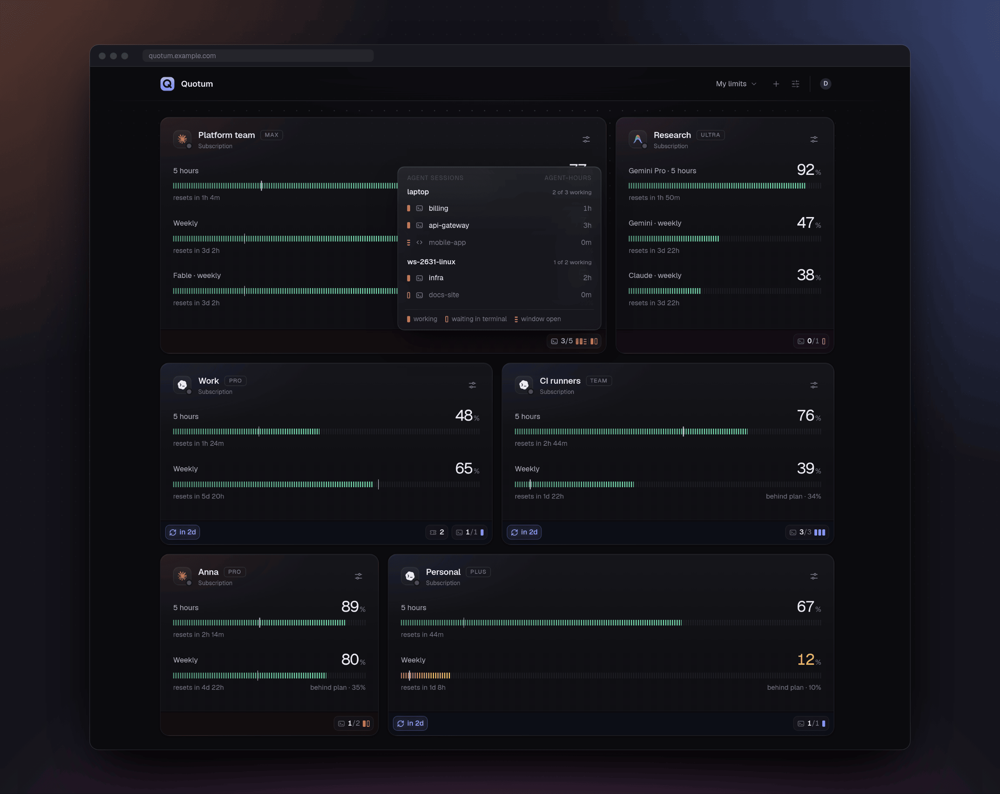
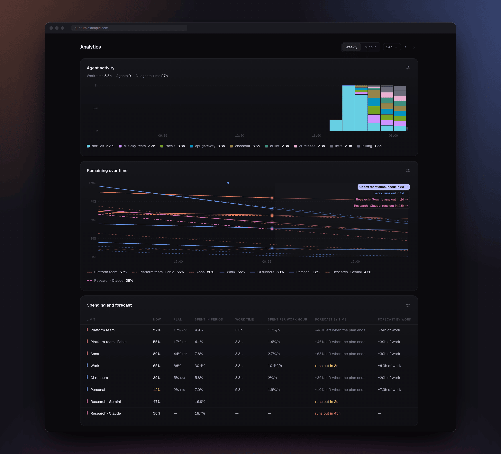
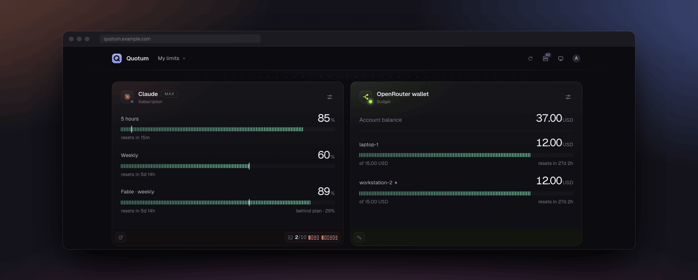

# Quotum

**English** · [Русский](README.ru.md)

[](https://github.com/padurets/quotum/releases/latest)
[](https://www.npmjs.com/package/quotum)
[](https://github.com/padurets/quotum/actions/workflows/ci.yml)
[](LICENSE)

Quotum shows how much of your coding-agent subscriptions is left — Claude Code, Codex
and Antigravity — on every machine you work on, in one place: for you alone or for a
whole team. It also shows OpenRouter balances and API-key caps, DeepSeek balances, and personal z.ai subscription quotas. You host it yourself;
the agent never reads provider tokens, and the hub encrypts the dedicated provider key you
explicitly connect.



For one machine, [download the desktop app](#desktop-app) for Windows or Linux: no hub
or account to set up. For several machines or a team, run the hub and agent below.

**Quick start**

```sh
# The hub; `docker logs quotum` shows the setup code of the first account
docker run -d --name quotum -p 8080:8080 -v quotum:/data -v quotum-keys:/keys ghcr.io/padurets/quotum-hub

# On every machine: confirm the code in the browser, then keep measuring in the background
npx quotum connect http://<the hub>:8080
npx quotum start
```

`npx quotum` alone prints this machine's limits without any hub. More in
[Getting started](#getting-started).

## Why I made it

I pay for several coding agents at once, and each has its own limits: a five-hour
window, a weekly one, sometimes a separate weekly window for a particular model. To know
where I stood I had to open each tool, type `/usage` and do the maths in my head: at
this pace, will the weekly limit last until the weekend? On top of that I don't work on
one machine. There is a laptop, a few remote dev environments and some containers, and
the same subscriptions are signed in on several of them.

I wanted one page that answers the questions I actually have:

- how much is left in each window, and when does it reset;
- am I spending faster than I planned for this week;
- what did the last few days look like.

I looked around first. What I found either lives on a single machine (the dashboard
started out reading from [CodexBar](https://github.com/steipete/CodexBar), a nice macOS
menu-bar app), or wants your provider tokens or browser cookies so it can call the
providers' APIs for you. The first didn't match how I work, and I didn't want to do the
second. So I wrote Quotum.

## How it works

There are two parts:

- **The agent** is a small native program (Rust, a single binary of about 3 MB). It
  runs on each machine where you use coding agents and asks their own command-line
  clients for the limits, the same numbers you see when you type `/usage`. It doesn't
  read tokens, make model requests or call provider APIs itself: the client does
  exactly what it does when you use it.
- **The hub** is a small web service (Node.js and SQLite) with the dashboard. Agents
  send it what they measured; it keeps the history and draws it.

```
 laptop ──┐
 dev VM ──┼── quotum agent ── HTTPS ──►  hub  ──►  dashboard
 box    ──┘   claude · codex · agy       SQLite
```

If one subscription is signed in on several machines, they don't all measure it. The hub
puts one machine on duty per subscription (preferably the one you're working on), the
others wait, and duty moves on when that machine goes quiet.

The agent also works on its own: `npx quotum` prints the limits of this machine and the
coding agents running on it, working or idle.

```
$ npx quotum
                                   left  resets
Codex pro     weekly                 4%  in 3d 16h
              free resets            1   expires in 29d 23h
Claude max    5 hours               98%  in 4h 27m
              weekly                89%  in 5d 9h
              Fable weekly         100%  in 5d 9h
Antigravity   Gemini 5 hours       100%  in 4h 59m
              Gemini weekly         96%  in 1d 3h

running here: 3 · 2 working
Claude        quotum               working  started 3h 39m ago
Claude        quotum · quotum.feat-18 working  started 52m ago
Codex         api                  idle     started 25m ago · editor
```

## What the dashboard shows

- **A card per subscription**, one meter per window: green above 30%, amber at 30% and
  below, red under 10%. A tick on the meter shows where your spending plan expects you
  to be right now. The dot on the provider's logo says whether the numbers are fresh.
- **Which agents run on it, and which of them work.** Under the limits, a mark per
  Claude Code, Codex or Antigravity session spending the subscription, grouped by
  machine: filled while it works, outlined while idle; its project, its folder (a
  worktree, a folder inside the repository) and its credited work time in agent-hours
  in the panel. Credit belongs to the current subscription and is unknown without a
  reliable session ID; a dash keeps that distinct from known zero. Terminals, editors
  and the Codex app alike.
- **Purchased Codex credits.** Additional funds appear in the subscription's footer,
  beside free resets, with the same compact amount and disclosure in the compact view.
  The initial estimate is 0.04 USD per credit; Currencies lets you set a personal
  USD-per-credit rate or restore the default. Hover over the amount for the exact
  native balance; open it for the rate and measurement time.
  **Subscription extra funds trends** shows balance history in its own widget, with its own
  subscription selection. It also appears in the board's **+** menu. Wallet budgets
  keep their separate chart and table.
  Shared boards require separate permission to show funds and subsequent history.
  Credit changes do not imply spending or top-ups.
- **Free resets.** When a provider grants resets of the limits (Codex does now and
  then), the card shows how many you have and until when.
- **A weekly spending plan.** By default you spend 30 / 25 / 15 / 15 / 10 / 5% on the
  six days after the reset and nothing on the seventh. Each subscription can have its
  own plan: a day at 0 is a day you don't spend, and it can be any day of the week.
- **Separate subscription limit and budget charts and metrics**, each movable, resizable and
  hideable. They share one time interval with agent activity; weekly/session switches
  affect only subscription limits. Budget history opens with balances, with spending in its settings.
- **A chart of the weekly or the 5-hour windows** over the last hour up to the last 30
  days. Ahead of now it draws the plan, where each window is going (a weekly one nearly
  flat over the hours its subscription usually spends nothing) and the next resets, as
  far as you choose; behind, it marks when limits came back early and when free resets
  were granted. Drag across it to zoom into a burst of work (on a phone, hold a finger
  on it first). ‹ and › move it by half its length; a horizontal touchpad swipe,
  Shift with the wheel, or Shift-drag moves all three charts continuously through time.
  The open page keeps the history it has read and fetches only missing
  or changed parts as measurements and agent work arrive.
- **A table with two forecasts:** what the period spent, each subscription's active time
  and what an active hour costs; turned on, agent-hours (each agent counted separately)
  and how much of the spending came while they worked (what went elsewhere, claude.ai or a phone, makes an
  active hour look dearer). Then where it leads. By time: whether each window runs out
  before its reset and around when, or roughly how much will be left, the same whatever
  period you look at. A weekly window goes by how the subscription spends: at the hours
  and on the days it usually does, through its resets, at the level of its last day; an
  arrow marks the last hours going faster than usual. A 5-hour window goes at its pace
  since it started. By work: roughly how many active hours are left. Over a range
  dragged on the chart it shows what that range cost: what was left at its start and
  end, what it spent in all and per hour, and what the agents worked.
- **Agent activity:** agent-hours over the same period, stacked by subscription, project
  or machine in bars of up to an hour (two hours over a month). Four agents over an hour
  make 4 agent-hours: the legend adds up to the total. Active time (at least one agent
  working), how many agents worked and the average at once are in the totals and
  tooltips. It zooms and moves through time as the chart does.
- **Reset announcements** from the community trackers [Codex Resets](https://codex-resets.com)
  and [Claude Resets](https://claude-resets.com), with a link to the source. You
  can turn them off.
- **Boards made of widgets** (a card per subscription, agent activity, the chart, the
  table, and a list of the running agents to turn on, gathered by project, machine or
  subscription, each group with how many of its agents work, their agent-hours and the
  date and time of their last activity, or now while any works; individual agents with
  their machines and subscriptions a click away), like a dashboard in Grafana:
  the cards show what is left now, the analytics under them share one set of filters.
  The owner places them on a six-column grid by dragging their heads, and resizes them
  to a third, a half, two thirds or the whole width. Each fills only the rows its content
  needs, so cards stack beside a tall list, unless the owner drags its bottom edge (or
  a bottom corner) to make it taller, or the list of agents shorter: the charts grow
  with it, a card never gets shorter than its content, and a shorter list ends with how
  many more rows it has, which opens them all. Either side edge changes the width. A
  double click on the bottom edge or a bottom corner, or Enter or Space on the bottom
  edge, gives a widget back the height of its content. The owner names the cards,
  hides the ones they don't need (the data keeps coming) and sets the plans; everyone on
  the board sees it arranged the same way. Once it's set, a lock keeps the widgets from
  moving under a passing pointer.
- **Choose measuring frequency.** In a subscription card's menu, choose **Auto** or
  every **1, 2, 5 or 15 minutes**. The choice is shared across every board showing that
  subscription and survives a hub restart. Anyone whose devices measure it may change
  it; a board's owner alone cannot. A device's own interval remains its minimum and
  can make measurements less frequent. Refresh and error pauses still apply.
- **Fresh limits on demand.** Choose **Refresh data** in a card's menu, or **Refresh all
  data** in the header's **Board controls** menu for every visible card on the board. Opening
  the menu shows the last measurement and errors; refreshing needs an explicit click.
  A circular loader by the
  logo shows that the card is waiting for fresh numbers. Refresh respects the device's
  interval and error pauses, and accepts one new request per minute per subscription.
  Every reader of a shared card can use it.
- **Your data, shared when you choose.** Everything your machines measure is on your
  personal board. On a shared board a team sees the limits its members share with it:
  each person decides which of their subscriptions it shows. A team subscription
  measured by several people is one card.

The interface is available in English and Russian.



## What I paid attention to

It's a pet project, but I wanted a tool I'd be comfortable running on every machine all
day, not a script thrown together over a weekend. In practice that meant:

- **It stays out of the way.** The agent idles at about 5 MB of memory. The expensive
  part is starting an agent's client (around a second of CPU and 100–230 MB of memory
  for that second), so Quotum starts as few of them as it can. They run one at a time,
  and only one machine measures each subscription, as often as the hub says, since it
  sees the subscription on every machine: every two minutes while it is in use anywhere
  or its numbers change; when little is left, every minute while it is active, every two
  and then every five as it stays quiet for hours; and less often while nothing happens,
  down to once every 15 minutes. The machine on duty asks the hub every 15 seconds, which
  starts nothing.
- **Client credentials stay where they are.** The agent never reads, stores or sends provider
  tokens or cookies. What leaves the machine: percentages and reset times, plan names,
  a one-way hash of each account id (so the hub can tell two machines share one
  account), the machine's name and random id, the short message of a client that
  failed, and which coding agents run on the machine: working or idle, since when, and
  the names of their project (the git repository their folder is in, else the folder)
  and folder (`sessions = false` and `projects = false` turn that off). With each
  question to the hub, whether its client is in use on the machine: a card tells the
  members of its boards that the subscription is in use right now, whatever those
  settings say. Where a board shows that subscription, whoever brought it, and the
  person whose agents they are is on the board, its members see them with the name of
  the machine they run on, each project under the name that person gave it, and when and
  how long they worked, by project and machine, from the later of when that person joined
  the board and when the subscription came to it (on their own board, all of it). The hub
  keeps when each agent worked, with its machine, project and folder names, for 90 days,
  and the names you give your projects until you undo them; you see and correct your
  projects through *Agent activity → Settings → Manage projects*. The full list is in the [spec](spec/ingest-v1.md#privacy).
- **The numbers mean what they say.** Only a real increase inside one reset window
  counts as spending. Resets, corrections and gaps in the data never show up as
  consumption. The agent says when its next measurement is due, so a sparse series isn't
  mistaken for a gap.
- **Few moving parts.** The agent has nine direct dependencies. The hub is Fastify and
  the SQLite built into Node, and the UI is plain React with about 199 KB of gzipped
  JavaScript. There is no telemetry. The hub reads the two reset trackers (or the
  mirror you name) every ten minutes; `QUOTUM_RESETS=off` turns that off. When you
  connect OpenRouter, it also reads that account's balance and key limits through
  fixed HTTPS requests using the management key you supplied.
- **Written down and tested.** The protocol between the agent and the hub is a spec
  ([spec/ingest-v1.md](spec/ingest-v1.md)). Tests cover the spending rules,
  resets, duty, scheduling, permissions, sharing, device pairing, the clients' answers and the
  translations. The TypeScript is strict and the Rust passes `clippy`.

## Status

It works: I use it every day. The agent installs with one command, or runs through npm
as `quotum`, with prebuilt binaries for Linux (x64 and arm64, any distribution), macOS
and Windows; the hub is a Docker image (`ghcr.io/padurets/quotum-hub`, amd64 and arm64).
A [desktop app](#desktop-app) for Windows and Linux brings the agent, hub and board
together on one machine. Automatic desktop updates and agent service registration
are still ahead ([roadmap](#roadmap)).

- Clients: Claude Code, Codex CLI, Antigravity CLI (`agy` 1.1.11 or newer).
- Platforms: I run it on Linux. The macOS and Windows binaries are cross-compiled and
  haven't had much use yet — issues are welcome.

## Getting started

**1. Start the hub.**

```sh
docker run -d --name quotum --restart unless-stopped -p 8080:8080 -v quotum:/data -v quotum-keys:/keys ghcr.io/padurets/quotum-hub
docker logs quotum            # shows the setup code for the first account
```

Open `http://<this machine>:8080` and create the first account with that code: until a
hub has an account, only whoever can read its log can claim it. Nothing else needs
setting up. For HTTPS on a domain of your own, [deploy/compose.yaml](deploy/compose.yaml)
runs the hub behind Caddy, which gets the certificate by itself:
`QUOTUM_DOMAIN=quotum.example.com docker compose up -d`.

Without Docker: clone the repository, then `cd hub && npm ci && npm run build && npm start` (Node.js 24 or newer),
which listens on `127.0.0.1:8080` and prints the setup code to the terminal.

**2. Install the agent and look at this machine's limits.**

```sh
curl -fsSL https://github.com/padurets/quotum/releases/latest/download/install.sh | sh    # Linux, macOS
irm https://github.com/padurets/quotum/releases/latest/download/install.ps1 | iex         # Windows (PowerShell)
quotum
```

The installer puts `quotum` in `~/.local/bin` (on Windows in
`%LOCALAPPDATA%\Programs\quotum`, added to your PATH), checked against the release's
checksums; `QUOTUM_INSTALL_DIR` and `QUOTUM_VERSION` change where and what. `quotum update`
keeps it up to date: with nothing new it is one small request, so a dev environment can
run it on every start. With Node.js 18 or newer, `npx quotum` works without installing
anything, and npm keeps it up to date.

**3. Connect the machine to the hub and keep it measuring.**

```sh
quotum connect http://127.0.0.1:8080
quotum start
```

`connect` shows a code: confirm it in the browser, and the machine is yours; what it
measures shows on your board. `start` keeps measuring and delivering in the background,
with its log in the state directory; `quotum` shows whether it runs and `quotum stop`
stops it. It does not come back by itself after a restart of the machine: for that,
have your system start `quotum run`, the same in the foreground (a systemd user
service, launchd, Windows autostart). With npx, put `npx` before every command.

**Many machines at once** (images, VMs, containers): create a machine token in the
dashboard (*Settings → Devices → Device tokens*) and start every machine with it. Each one joins as
yours by itself:

```sh
QUOTUM_HUB_URL=https://quotum.example.com QUOTUM_HUB_TOKEN=qt_m_… quotum run
```

In a dev environment that starts often (Coder, Codespaces, a devcontainer), its start
script can bring the agent up to date and start it in the background:

```sh
quotum update || true         # quick when there is nothing new; offline, it gives up in seconds
QUOTUM_HUB_URL=https://quotum.example.com QUOTUM_HUB_TOKEN=qt_m_… quotum start
```

A machine token is one person's: every teammate creates their own. Machines are named
in *Settings → Devices*, so an image doesn't need a name per copy.

**Sharing with a team.** Create a shared board and invite people with a link from
*Board controls → Members*. Share your subscriptions through the board's *Add widget*
menu. In *Board settings → Provided data*, you can take yours off again at any time;
the board's owner can take any shared source off their board.

**By hand:** every [release](https://github.com/padurets/quotum/releases) has the agent
for Linux, macOS and Windows as an archive (`quotum-cli-<version>-<platform>`, with the
licences) and as a bare binary (`quotum-cli-<platform>`, what the installers and
`quotum update` fetch), with checksums (`SHA256SUMS`) and
[build provenance](https://docs.github.com/en/actions/security-for-github-actions/using-artifact-attestations)
(`gh attestation verify <file> -R padurets/quotum`). **From source:**
`cd agent && cargo build --release` (Rust 1.85 or newer) gives `target/release/quotum`.

## Connecting DeepSeek

In **My connections**, choose **Connect → DeepSeek** and enter a dedicated API key
from [DeepSeek key settings](https://platform.deepseek.com/api_keys). Name the account
privately, or explicitly reconnect an existing one. DeepSeek does not return an account
ID: you declare the identity, and replacing a key requires confirmation that it belongs
to the same account. Removing access preserves that identity and retained history.
Another account needs a new connection. An ordinary API key may authorize model calls;
Quotum uses only the fixed [balance read](https://api-docs.deepseek.com/api/get-user-balance/).
Key expiry is unknown and saving it requires an explicit acknowledgement. Server and
desktop modes use the same encrypted credential protection described in [SECURITY.md](SECURITY.md).

The card and compact panel use the same budget layout as OpenRouter: one
**Available balance** in your display currency, followed by any supported limits. DeepSeek has no limit
scales. USD is the initial display currency. **Settings → Currencies** lets you choose a
standard currency or create a personal unit with your own rates. Your choice applies to
monetary cards, the compact panel, tables and charts on every board, independently of
other readers. Edit names and precision, add dated rate versions, or archive and restore
a currency. Archiving the selected currency requires a replacement. Saved estimates
keep their original rate; unavailable conversion is distinct from zero. Reported reference currency takes precedence. When only CNY is reported,
the shared hub currency service uses
the [ECB daily reference rates](https://www.ecb.europa.eu/stats/policy_and_exchange_rates/euro_reference_exchange_rates/html/index.en.html)
to record a separate USD estimate, marked **≈**. Click the balance amount for its
granted and topped-up composition; an estimate also gives its original CNY amount
and rate date. Native observations are saved before a rate read; the shared, persisted
rate cache contains no credentials or account information. Historical estimates keep
their original rate. Without a usable rate, CNY is retained and USD stays unknown or stale.
All original balances, estimates, rate provenance, funds status and safe provider
context are retained within the history retention period. Budget history and its table
appear beside subscription analytics. Totals are selected by
default; components can be added in the chart's settings. The total is not added to its
components. Reported USD and converted CNY are never summed. Spending and top-up events
are **unavailable** because the endpoint has no spending counter; a balance change
cannot establish spending. An omitted currency keeps its last value as stale and
breaks its history until a valid observation returns. A failed request preserves the
last valid reading. The supplier's insufficient-funds notice is separate from rejected
access. Saved access and private account names remain owner-only on shared boards.
Only holders may refresh the source.

## Connecting OpenRouter

On the chosen board, open **Add widget** (+) in the header, then **Connect** → **OpenRouter**.
Create a dedicated OpenRouter management key in
[OpenRouter management-key settings](https://openrouter.ai/settings/management-keys)
and paste it into the password field. **Connect and add** verifies it, saves your access
and shows its balance on that board in one action. Keys without expiry are supported
without a second confirmation. On a shared board, the form explains which data its
members will see before you submit.
The key can create, edit and delete provider API keys; Quotum uses only fixed read
operations. A new server creates its encryption key in separate persistent storage, and its operator
can decrypt saved access. See [SECURITY.md](SECURITY.md) for the protection and limits.

The avatar opens full settings pages for your profile, connections, devices, projects
and interface. The Quotum logo returns to the selected board and its time range.
Board settings belong to the selected board. Add lists only absent or
hidden widgets you may add; the lock switches between free arrangement and a locked
layout. Connecting from **Settings → My connections** keeps access personal until you
explicitly choose a board. Existing access is reused; replacing its key is a separate
action. **Recent additions and recovery** finds saved results after a lost response or
reload, without duplicating access or restoring a later hidden or removed card.

The original plan label stays beside the title; a small second line identifies the
resource as **Subscription** or **Budget**. The budget card shows only current state:
its balance and enabled key-limit scales with their reset times. Its settings switch
individual scales, including keys beyond the initial five-key preview. Scales use the
same segmented meters as subscriptions; keys without a spending limit have no scale.
Spending belongs to analytics.
Settings show at most ten keys per page. Access turns amber seven days before expiry;
expired, revoked or forbidden access is red. Working keys without expiry have no expiry
mark. Temporary read failures are amber.
The chart's own settings select
key usage and remaining limits for the independent budget chart and table.
Account balances are selected
by default; at most 32 logical series are drawn, with visible overflow. The chart uses
one unit per axis and keeps the same time range and gestures as subscription history.
Wallet balances have no percentage; only positive key limits do.

A top-up is separate from spending: spending comes from the lifetime usage counter.
Before the first baseline, history is unknown. Partial history and spending observed
after a gap retain their uncertainty and original interval. Key names and monetary
measurements are shared with board members, while saved access details stay private.
Only holders can refresh a hub-measured source. Replace or remove your saved access in
**Settings → My connections**; removing it does not revoke the provider key. Revoked or expired access
preserves the last measurements. The compact panel displays money too; tray minimums
and quota notifications continue to use percentage windows only.



## Connecting z.ai Personal

Open **My connections**, choose **Connect**, then **z.ai Personal (Global)**.
Create a separate key for Quotum in [z.ai key settings](https://z.ai/manage-apikey/apikey-list).
An ordinary API key may also permit model requests; Quotum only reads the personal
Global Coding Plan quota operation published in the
[official usage plugin](https://docs.z.ai/devpack/extension/usage-query-plugin).
The provider does not report the key's expiry, so saving it requires explicit consent.
Server operators can decrypt saved access; desktop protection uses the app's trusted
key storage. Removing access does not revoke the provider key.

The **Subscription** card and compact panel show independent five-hour and weekly
remaining quotas as percentages, using the same rows and period labels as other
subscriptions. Exact credits and reported allowances are available in the value's
tooltip; supplied reset times appear below the scale.
Unknown resets stay unknown. Current credit-generation plans are supported; legacy
prompt/token/MCP and unknown formats stay unavailable. This provider-published plugin
interface has no versioned quota OpenAPI schema. Invalid or missing readings retain
last valid values without refreshing them. An allowance does not guarantee model
availability or concurrency.

Both quotas also appear in the ordinary subscription chart and measurement table:
choose **5-hour** or **Weekly**, alongside the other subscriptions. The chart's legend,
source colours, time range and period visibility are shared. Historical percentages
use the allowance reported at each measurement. The quotas overlap and are never
added or converted to money. Forecasts, agent-work attribution and native quota
notifications are unavailable for this provider. Gaps and expired readings stay
unknown in history. Only source holders may refresh or change frequency.

Every new connection creates a separate source local to its owner. Replacing a key
requires confirmation that it belongs to the same account and preserves history;
the quota API cannot verify that declaration. For another account, connect separately.
Credential details remain private on shared boards.

## Updating

Before replacing the hub, stop it and back up its data directory (the Docker volume
`quotum` in the examples). Start the new image with that same volume; it migrates the
database automatically. A rollback needs the old image and the backup from before the
upgrade: an older hub refuses a newer database layout.

When upgrading from a hub older than 0.4, subscription measurements, boards and settings
remain. The old totals of agent work are replaced by per-session history: work time and
forecasts based on it become available from the upgrade onward. The earlier limit
history remains on the chart.

Upgrading from 0.4 preserves subscription measurements, agent-work history, boards and
settings. Board layouts saved before the widget grid are converted when opened. Reload
open dashboard tabs after upgrading so the page and hub use the same history contract.

Upgrading from 0.5 also preserves subscription measurements, agent-work history, boards
and settings. Subscription measuring needs no new configuration. To connect OpenRouter
on a server hub, configure its separate encryption key as described in
[deploy/README.md](deploy/README.md); back it up separately from the data directory.
The desktop app manages its encryption key as described in [SECURITY.md](SECURITY.md).

On each machine, run `quotum update`, then restart the background agent with
`quotum stop` and `quotum start` (or restart its service). With npm, use the latest
`quotum` package. Update the hub first: older agents still deliver measurements to the
new hub; the new agents follow its measuring schedule.

## Desktop app

For one machine there is an app for Windows and Linux (macOS comes later): the agent of
this machine, a hub of its own and its board in a window, with a tray icon. No account,
no server. Download it from [Releases](https://github.com/padurets/quotum/releases/latest):

| System | Package |
|---|---|
| Windows x64 | `quotum-desktop-<version>-windows-x64-setup.exe` or `…-windows-x64-portable.zip` |
| Linux x64 | `quotum-desktop-<version>-linux-x64.deb`, `.rpm` or `.AppImage` |

The release includes `SHA256SUMS` and build provenance for these packages too.
The [Desktop workflow](.github/workflows/desktop.yml) builds and smoke-tests the same
packages on each pull request and on `main`; its development artifacts also carry the
commit in their names. To build it yourself, see [CONTRIBUTING.md](CONTRIBUTING.md).

- **Windows 10 and 11:** run `quotum-desktop-<version>-windows-x64-setup.exe`. It installs for you
  alone, into `%LOCALAPPDATA%\Quotum`, with no administrator rights, and brings WebView2
  if Windows lacks it. The installer isn't signed yet, so SmartScreen asks first: *More
  info → Run anyway*.
  Or extract the portable ZIP and run `Quotum/quotum-desktop.exe` without installing.
  Keep the whole extracted folder together. It uses the same data and settings in your
  Windows profile as the installed app; nothing is stored beside the executable.
  The portable version needs [Microsoft Edge WebView2 Runtime](https://developer.microsoft.com/microsoft-edge/webview2/)
  already installed (the setup.exe installs it when needed).
- **Linux** (x64): the packages include Chromium and Node.js. On Debian 12,
  Ubuntu 22.04 or newer use `sudo apt install
  ./quotum-desktop-<…>.deb`; on Fedora use `sudo dnf install ./quotum-desktop-<…>.rpm`.
  Elsewhere, make the AppImage executable (`chmod +x`) and run it; GTK3 and NSS must
  be available on the system. If FUSE is unavailable,
  add `--appimage-extract-and-run`. The AppImage needs unprivileged user namespaces for
  Chromium's sandbox; use a native package when the system restricts them. NVIDIA
  systems use X11/XWayland when available. If graphics fail, quit completely and try
  `quotum-desktop --software-rendering` (or add that option to the AppImage command).
  It affects that launch only. Closing the window frees Chromium; measuring and the
  tray continue in the small Rust controller.

When trying a new build, choose *Quit* in the old one first: closing its window keeps
it running, and another launch opens that same process. Check the commit in settings;
an AppImage's start-at-login entry also needs to point to the intended file.

The app opens its board, and the first numbers come within a minute. The gear opens its
settings: which providers are measured and how often, running agents, start at login,
the version and *Quit*. Measuring settings are shared with `quotum` ([Configuration](#agent));
notification preferences and language belong to the app.

- **Closing the window** leaves it measuring. *Open Quotum* in the tray menu or starting
  the app again opens the full window. *Quit* is in the settings and in the tray's menu. GNOME shows tray
  icons only with an extension (AppIndicator); without one, start the app again to open
  its window.
- **Limits in the tray.** The icon follows the tightest visible limit: green above 30%,
  amber from 10% through 30%, red below 10%. A separate mark means some figures are
  stale or unavailable; no figures never means a full quota. Click the icon on Windows,
  or choose *Limits* from its menu on Linux, for a compact panel of the same limits,
  reset times and working agents as the board. It closes on Escape or losing focus.
- **Notifications** announce low and critical quota, a reset confirmed by a measurement,
  and newly announced scheduled resets from community trackers. Each kind has its own
  switch, on by default. Hidden cards and windows are excluded. Thresholds are notified
  once per confirmed cycle; jumping straight to critical gives only that alert. Starting,
  waking or reconnecting establishes a fresh baseline, without replaying missed events.
  Gaps and ambiguous provider corrections may hide a reset; the timer alone is not
  evidence. System notification settings and Do Not Disturb can suppress delivery.
  The app requests no sound. Windows portable builds use the same native delivery as
  installed builds. Missing Linux tray or notification services do not stop measurements.
- **Start at login** turns on by itself the first time the app measures and starts it
  without the window. Turn it off in the settings, and do that before uninstalling. The
  entry names the AppImage or Windows portable EXE by its path: keep it where it is
  (after a move, turn start at login off and on again).
- **Updates are manual.** Download the newer release and quit the app before installing
  it over the old one. For the portable
  version, replace the whole extracted folder; your data stays in your Windows profile.
- **With `quotum`.** One agent measures a machine. If `quotum` already does, the app
  asks once whether to take over. A `quotum` of this version then waits and goes on by
  itself when the app quits, so `quotum run` as a service keeps working; an older one
  stops (update it). A hub that `quotum` delivered to gets nothing from this machine
  while the app runs.
- **Its data**, including the board's history, is in
  `%LOCALAPPDATA%\com.padurets.quotum` or `~/.local/share/com.padurets.quotum`.
  The logs are in `%LOCALAPPDATA%\com.padurets.quotum\logs` on Windows and
  `~/.cache/com.padurets.quotum/logs` on Linux.
- **Network access:** the app reads reset announcements from Codex Resets and Claude
  Resets, as every hub does (`QUOTUM_RESETS=off` in the app's environment turns that
  off). If you connect OpenRouter, its hub also reads your account through fixed HTTPS
  requests with the management key you supplied. The local hub listens on `127.0.0.1`
  alone, behind a key only the app's windows get; it does not send measurements to a
  server hub.
- **Size:** Linux packages carry both Chromium for the window and Node.js for the hub.
  Windows uses the system WebView2: about 27 MiB for setup.exe or 39 MiB for the ZIP.
  In a Windows 11 VM with five subscriptions, idle working set across the app, Node
  and WebView2 was about 342 MiB with the window open and 47 MiB after closing it;
  CPU was 0.76% and 0.24% of one core over 30 seconds. Memory varies with history,
  WebView2 and Windows; virtual graphics do not establish physical display performance.

## Configuration

### Agent

Everything is optional. On Linux the file is `~/.config/quotum/config.toml`;
`quotum config` shows where it is on your system and what is in effect.

```toml
# interval = 120        # seconds, 60 to 86400: with a hub, the most often a client is measured
                        # (left out, follows the subscription’s hub frequency); without one, how often
eco = true              # without a hub (or while it does not answer): measure less often while nothing changes
sessions = true         # tell the hub which coding agents run here, working or idle
projects = true         # with the names of their projects and folders

[machine]
name = "work-laptop"    # the name the machine reports (default: host name); renaming it on the hub wins

[hub]
url = "https://quotum.example.com"
token = "qt_m_…"

[providers.antigravity]
interval = 300
account = "work"        # tells two Antigravity subscriptions apart (agy doesn't say which one it is)
# enabled = false
# path = "/opt/agy/bin/agy"
```

The environment variables `QUOTUM_HUB_URL`, `QUOTUM_HUB_TOKEN`,
`QUOTUM_INTERVAL`, `QUOTUM_CONFIG` and `QUOTUM_STATE_DIR` override the file. Other
commands: `quotum --json` (one measurement in the ingest format), `quotum --only codex`,
`quotum start` / `quotum stop`, `quotum disconnect`, `quotum update` (`--check` only
says whether there is a newer release; `QUOTUM_RELEASES_URL` points it at a mirror). An
agent running in the background keeps its version until it is started again.

### Hub

| Variable | Default | Meaning |
|---|---|---|
| `QUOTUM_BIND` | `127.0.0.1` (image: `0.0.0.0`) | Address to listen on |
| `QUOTUM_PORT` | `8080` | Port to listen on |
| `QUOTUM_ALLOWED_HOSTS` | `127.0.0.1,localhost` (image: `*`) | Host names the hub answers to, or `*` for any; other hosts get 403. Setting it replaces the default |
| `QUOTUM_PUBLIC_URL` | taken from the request | The address shown to agents and used in invite links |
| `QUOTUM_TRUST_PROXY` | — | Believe a proxy about the client's address and protocol: `true`, a number of hops, or addresses and CIDR ranges |
| `QUOTUM_DATA_DIR` | `hub/data` (image: `/data`) | Where the SQLite database lives |
| `QUOTUM_SECRET_KEY`, `QUOTUM_SECRET_KEY_FILE` | automatic separate storage | Optional explicit encryption key: 32 random bytes as unpadded base64url, or a protected file outside the data directory. Set one input only; explicit inputs override automatic storage. See [server deployment](deploy/README.md) |
| `QUOTUM_SECRET_DIR` | POSIX: sibling of the real data directory with `.keys`; image: `/keys` | Optional separate persistent key directory, outside data. Not used with an explicit key. Windows standalone uses private HKCU registry storage instead and rejects this option in automatic mode |
| `QUOTUM_SECRET_KEY_PREVIOUS`, `QUOTUM_SECRET_KEY_PREVIOUS_FILE` | — | Matching previous encryption key during rotation. Set one previous input only; back up keys separately and retain the old key for its matching backups |
| `QUOTUM_SETUP_CODE` | random, printed at start | The code the first account needs while the hub has none |
| `QUOTUM_SIGNUP` | `invite` | `open` lets anyone sign up; otherwise only the first person and people with an invite |
| `QUOTUM_RESETS` | on | `off` stops polling the community reset trackers |
| `QUOTUM_RESETS_CODEX_URL`, `QUOTUM_RESETS_CLAUDE_URL` | `https://codex-resets.com/api/v1/status`, `https://claude-resets.com/api/resets` | Where to read Codex Resets and Claude Resets instead, such as a mirror where the tracker's bot check stops your server: the full address of an endpoint that answers the same JSON, without a user name or password |
| `QUOTUM_FRAME_ANCESTORS` | — | Extra origins allowed to embed the dashboard |

**Opening the hub to other machines.** Put it behind HTTPS (sessions are cookies and
tokens are bearer secrets): [deploy/compose.yaml](deploy/compose.yaml) does it with
Caddy. Behind a proxy of your own, tell the hub its address and trust the proxy:
`QUOTUM_PUBLIC_URL=https://quotum.example.com QUOTUM_TRUST_PROXY=true`. An open
dashboard keeps one stream (`/api/events`) the hub pushes changes on: let the proxy
pass it as it comes (nginx does, as the hub asks it to); where a proxy holds it back,
the page asks with long polls instead. Over HTTP/2, as Caddy serves it, a browser keeps
up to eight boards live at once (a tab hidden for half a minute lets its stream go);
over plain HTTP/1.1, about five.

## More

- [docs/architecture.md](docs/architecture.md): how the parts fit, how measuring and
  scheduling work, people, boards and devices.
- [spec/ingest-v1.md](spec/ingest-v1.md): what the agent sends to the hub; anything can
  implement it. [spec/dashboard-v1.md](spec/dashboard-v1.md): what the hub tells an open
  dashboard.
- [CONTRIBUTING.md](CONTRIBUTING.md): checking a change and what to keep in mind;
  [SECURITY.md](SECURITY.md): reporting a vulnerability privately.
- `npm run demo` in `hub/` (after `npm run build`): a live board on throwaway data with
  every state the dashboard knows that lasts on a working hub, no network or account
  needed; Ctrl+C stops it and leaves nothing behind. `npm run demo -- showcase` is the
  board of the images above. `npm run demo -- money --still` puts subscriptions beside
  every monetary case on Ana's personal board.

Project layout:

```
agent/crates/core     adapters for each client, schedule, settings, delivery to the hub
agent/crates/cli      the `quotum` command
npm/                  the npm packages: a launcher and a prebuilt binary per platform
install/              the installers for `curl … | sh` and PowerShell
deploy/               running the hub with Docker Compose behind Caddy (HTTPS)
desktop/              the desktop app (Rust, Electron on Linux, Tauri on Windows): the agent, its own hub and board in a window
.github/workflows     tests on every push; everything released from a version tag
spec/                 the protocols: the agent to the hub, the hub to its dashboard
hub/server/domain     the rules: windows, spending, resets, the ingest format
hub/server/store      SQLite: layout, measurements, people and devices
hub/server/routes     HTTP routes for people and for agents
hub/server/*.ts       ingest, duty, device pairing, sessions, the reset trackers
hub/ui                the dashboard (React), translations in hub/ui/i18n
hub/demo              the demo board: a catalogue of every state a working hub holds, kept alive
```

`npm test` and `npm run typecheck` in `hub/`, `cargo test` and `cargo clippy` in
`agent/` and `desktop/` check everything (the app's after `node desktop/prepare.mjs`);
CI runs them on every push. `node npm/build.mjs` builds the
npm packages (it needs cargo-zigbuild and zig; see the script), `docker build hub` the
hub's image.

### Releasing

Prepare a release branch and a pull request into `main`. Set the new version in
`agent/Cargo.toml` (`[workspace.package]`), `desktop/Cargo.toml` and `hub/package.json`,
then update their lock files. The npm package template stays at `0.0.0`:
`npm/build.mjs` sets the published packages' version from the agent's manifest.
Add the hashes of any new database layout steps to `RELEASED` in
`hub/server/test/schema.test.ts`; every step shipped by a release is frozen.
Refresh the README screenshots in both languages from the demo board, check the upgrade
instructions and prepare the release notes outside the repository.

For example, to prepare 0.6.0 on that branch:

```sh
(cd hub && npm version 0.6.0 --no-git-tag-version)
# agent/Cargo.toml and desktop/Cargo.toml: version = "0.6.0"
(cd agent && cargo metadata --format-version 1 >/dev/null)
(cd desktop && cargo metadata --format-version 1 >/dev/null)
```

Run the [full checks](CONTRIBUTING.md#checking-a-change), including the dashboard
benchmark, and wait for CI and Desktop checks. The maintainer approves and squash-merges
the pull request. Wait for the checks on the resulting `main` commit too: that is the
commit to tag. Only after the maintainer approves that specific release:

```sh
git fetch origin
git switch main
git pull --ff-only origin main
git tag -a v0.6.0 -F /path/to/release-notes.md --cleanup=verbatim
git push origin v0.6.0
```

[release.yml](.github/workflows/release.yml) refuses a tag that is not annotated or
whose version differs from any of those six files. The tag's message becomes the
release notes. The workflow checks the code again, builds the agent for every platform
and runs the desktop packages through their installation and smoke checks. Only after
all binaries are ready does it publish the hub's image and npm packages, then create
the GitHub release with the CLI and desktop downloads, checksums and provenance.
A tag publishes packages and images; an npm version cannot be reused.

npm accepts the packages from that workflow alone, without a token (trusted publishing).
A new npm package, for a new platform, is published once by hand and then trusted with
`node npm/trust.mjs`. npm trusts the repository by its name: after renaming it, run that
again, and it replaces the old trusts.

### Adding a language

The dashboard's text lives in `hub/ui/i18n`. Copy `ru.ts` to a file named after the
language's code (`de.ts`), translate the strings, rename its export, and add it to
`LOCALES` in `index.ts` (an import and one line). The type checker and `npm test` then
make sure every key is translated, the `{placeholders}` match and every plural form the
language has is there.

## Roadmap

1. A team view on shared boards: people × providers at a glance.
2. Autostart: a systemd user service, launchd, Windows.
3. Automatic updates of the desktop app, then the app on macOS.

## Credits and license

Thanks to [CodexBar](https://github.com/steipete/CodexBar) for showing the way and for
being the first data source of this dashboard, and to the people behind
[Codex Resets](https://codex-resets.com) and [Claude Resets](https://claude-resets.com).
Provider icons come from [LobeHub Icons](https://github.com/lobehub/lobe-icons). Quotum
is not affiliated with Anthropic, OpenAI or Google.

MIT, see [LICENSE](LICENSE). Third-party notices are in [NOTICE.md](NOTICE.md).
