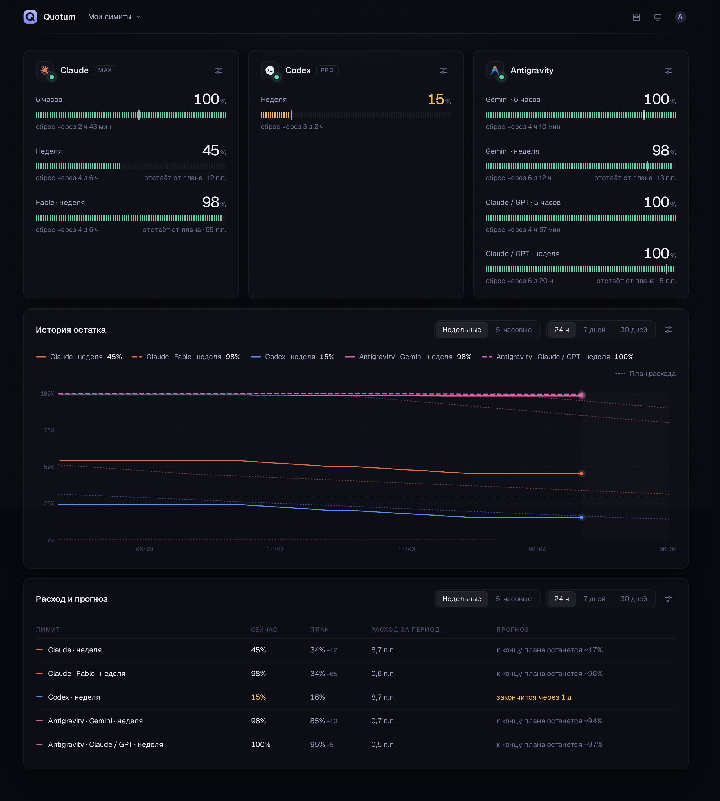

# Quotum

[English](README.md) · **Русский**

Quotum показывает, сколько осталось от подписок на кодинг-агентов — Claude Code, Codex
и Antigravity — на всех машинах, где вы работаете, в одном месте.



## Зачем я это сделал

Я плачу сразу за несколько кодинг-агентов, и у каждого свои лимиты: пятичасовое окно,
недельное, иногда ещё отдельное недельное под конкретную модель. Чтобы понять, где я
нахожусь, приходилось открывать каждый инструмент, набирать `/usage` и прикидывать в
уме: если так пойдёт дальше, хватит ли недельного лимита до выходных? К тому же я
работаю не на одной машине: есть ноутбук, несколько удалённых dev-окружений и
контейнеры, и одни и те же подписки залогинены сразу на нескольких.

Мне нужна была одна страница, которая отвечает на мои реальные вопросы:

- сколько осталось в каждом окне и когда оно сбросится;
- не трачу ли я быстрее, чем планировал на эту неделю;
- как это выглядело последние дни.

Сначала я поискал готовое. Всё, что нашлось, либо живёт на одной машине (сам дашборд
поначалу брал данные из [CodexBar](https://github.com/steipete/CodexBar), хорошего
приложения для строки меню macOS), либо просит токены провайдеров или cookies браузера,
чтобы ходить в их API от вашего имени. Первое не подходило под то, как я работаю, а
второго делать не хотелось. Поэтому я написал Quotum.

## Как это устроено

Две части:

- **Агент** — маленькая нативная программа (Rust, один бинарник около 3 МБ). Он
  работает на каждой машине, где вы пользуетесь кодинг-агентами, и спрашивает лимиты у
  их собственных консольных клиентов — те же цифры, что вы видите по `/usage`. Он не
  читает токены, не делает запросов к моделям и сам не ходит в API провайдеров: клиент
  делает ровно то же, что и когда им пользуетесь вы.
- **Хаб** — небольшой веб-сервис (Node.js и SQLite) с дашбордом. Агенты присылают ему
  замеры, он хранит историю и рисует её.

```
 ноутбук ──┐
 dev VM  ──┼── агент quotum ── HTTPS ──►  хаб  ──►  дашборд
 сервер  ──┘   claude · codex · agy       SQLite
```

Если одна подписка залогинена на нескольких машинах, мерят её не все. Хаб назначает на
каждую подписку одну дежурную машину (по возможности ту, за которой вы сейчас
работаете), остальные ждут, а если дежурная замолкает, дежурство переходит к другой.

Агент работает и сам по себе: `npx quotum` печатает лимиты этой машины.

```
$ npx quotum
                                   left  resets
Codex pro     weekly                 4%  in 3d 16h
              free resets            1   expires in 29d 23h
Claude max    5 hours               98%  in 4h 27m
              weekly                89%  in 5d 9h
              Fable weekly         100%  in 5d 9h
Antigravity   Gemini 5 hours       100%  in 4h 59m
              Gemini weekly         96%  in 1d 3h
```

## Что показывает дашборд

- **Карточка на каждую подписку**, по шкале на окно: зелёная выше 30%, жёлтая от 30% и
  ниже, красная меньше 10%. Засечка на шкале показывает, где вы должны быть сейчас по
  плану расхода. Точка на логотипе провайдера говорит, свежие ли цифры.
- **Бесплатные сбросы.** Когда провайдер выдаёт сбросы лимитов (Codex время от времени
  так делает), на карточке видно, сколько их у вас и до какого числа.
- **План расхода на неделю.** По умолчанию 30 / 25 / 15 / 15 / 10 / 5% на шесть дней
  после сброса, на седьмой ничего. У каждой подписки план можно настроить свой: 0 —
  день без трат, и это может быть любой день недели.
- **График недельных или пятичасовых окон** за 24 часа, 7 или 30 дней. Справа от
  «сейчас» видны план и ближайшие сбросы, насколько далеко — выбираете вы; слева
  отмечено, когда лимиты вернулись досрочно и когда выдали бесплатные сбросы.
- **Таблица с прогнозом:** сколько потрачено за период и, если тратить так же, хватит
  ли окна до сброса (или до конца плана) и сколько примерно останется.
- **Объявления о сбросах** из общественных трекеров [Codex Resets](https://codex-resets.com)
  и [Claude Resets](https://claude-resets.com), со ссылкой на источник. Их можно
  выключить.
- **Доска из виджетов** (карточка на каждую подписку, график, таблица), как дашборд в
  Grafana.
  Владелец доски перетаскивает их, прячет ненужные (данные при этом продолжают
  собираться) и задаёт планы; все участники видят доску одинаково.
- **Доски.** У каждого есть личная доска. На общей доске команда видит лимиты друг
  друга; её владелец даёт ей имя и приглашает людей по ссылке.

Интерфейс есть на английском и русском.

## На что я обращал внимание

Это пет-проект, но мне хотелось инструмент, который не страшно держать запущенным на
каждой машине весь день, а не скрипт, собранный на коленке за выходные. На деле это
значит вот что.

- **Не мешает.** В простое агент занимает около 5 МБ памяти. Дорого здесь другое —
  запуск клиента агента (около секунды процессора и 100–230 МБ памяти на эту секунду),
  поэтому Quotum запускает их как можно реже. Клиенты работают строго по одному, по
  умолчанию раз в две минуты. Если ничего не меняется и клиентом никто не пользуется,
  его опрашивают реже, вплоть до раза в 15 минут. И каждую подписку мерит только одна
  машина.
- **Доступы остаются на месте.** Quotum никогда не читает, не хранит и не отправляет
  токены провайдеров или cookies. С машины уходят проценты и время сбросов, названия
  тарифов, необратимый хеш идентификатора каждого аккаунта (чтобы хаб понимал, что две
  машины сидят на одном аккаунте), имя машины и её случайный id, а при сбое — короткое
  сообщение клиента. Полный список — в [спецификации](spec/ingest-v1.md#privacy).
- **Цифрам можно верить.** Расходом считается только реальный рост внутри одного окна
  сброса. Сбросы, поправки провайдера и пропуски в данных никогда не превращаются в
  «потраченное». Агент сообщает, когда будет следующий замер, поэтому редкие замеры не
  принимаются за пропуск.
- **Мало движущихся частей.** У агента девять прямых зависимостей. Хаб — это Fastify и
  встроенный в Node SQLite, интерфейс — обычный React, около 90 КБ JavaScript в gzip.
  Телеметрии нет; сам по себе хаб обращается только к двум трекерам сбросов, раз в
  десять минут, и `QUOTUM_RESETS=off` это выключает.
- **Описано и проверено.** Протокол между агентом и хабом оформлен как спецификация
  ([spec/ingest-v1.md](spec/ingest-v1.md)). Почти 90 тестов проверяют правила расхода,
  сбросы, дежурство, расписание, права, подключение устройств, разбор ответов клиентов
  и переводы. TypeScript строгий, Rust проходит `clippy`.

## Статус

Работает: я пользуюсь им каждый день. Агент опубликован в npm как `quotum`, с готовыми
бинарниками для Linux (x64 и arm64, любой дистрибутив), macOS и Windows; хаб — это
Docker-образ (`ghcr.io/padurets/quotum-hub`, amd64 и arm64). Дальше — установщики,
автозапуск и десктопное приложение ([планы](#планы)).

- Клиенты: Claude Code, Codex CLI, Antigravity CLI (`agy` 1.1.11 или новее).
- Платформы: сам я запускаю на Linux. Бинарники для macOS и Windows собраны
  кросс-компиляцией и пока почти не обкатаны — issues приветствуются.

## Как запустить

**1. Запустите хаб.**

```sh
docker run -d --name quotum --restart unless-stopped -p 8080:8080 -v quotum:/data ghcr.io/padurets/quotum-hub
docker logs quotum            # покажет код установки для первого аккаунта
```

Откройте `http://<эта машина>:8080` и создайте первый аккаунт с этим кодом: пока на хабе
нет ни одного аккаунта, занять его может только тот, кто видит его лог. Больше ничего
настраивать не нужно. Для HTTPS на собственном домене
[deploy/compose.yaml](deploy/compose.yaml) ставит хаб за Caddy, который сам получает
сертификат: `QUOTUM_DOMAIN=quotum.example.com docker compose up -d`.

Без Docker: склонируйте репозиторий, затем `cd hub && npm ci && npm run build && npm start` (Node.js 24 или новее) —
хаб слушает `127.0.0.1:8080` и печатает код установки в терминал.

**2. Посмотрите лимиты этой машины** (для `npx` нужен Node.js 18 или новее).

```sh
npx quotum
```

**3. Подключите машину к хабу и оставьте её мерить.**

```sh
npx quotum connect http://127.0.0.1:8080
npx quotum run
```

`connect` покажет код: подтвердите его в браузере и выберите доску. `run` продолжает
мерить и отправлять, поэтому запускайте его так же, как другие фоновые программы
(пользовательский сервис systemd, launchd, автозапуск Windows). После
`npm install -g quotum` команда называется просто `quotum`.

**Много машин сразу** (образы, виртуалки, контейнеры): создайте токен доски в дашборде
(*Устройства → Подключить*) и запускайте с ним каждую машину — она сама появится на
доске:

```sh
QUOTUM_HUB_URL=https://quotum.example.com QUOTUM_HUB_TOKEN=qt_b_… npx quotum run
```

Машины, подключённые по токену доски, принадлежат тому, кто создал токен. Если токен
общий на несколько человек, `QUOTUM_OWNER` (или `--owner`) говорит, чья это машина:
почта участника доски привязывает её к этому участнику, любое другое имя показывается
как есть.

**Без Node.js:** в каждом [релизе](https://github.com/padurets/quotum/releases) есть
агент для Linux, macOS и Windows одним файлом, с контрольными суммами и
[подтверждением сборки](https://docs.github.com/en/actions/security-for-github-actions/using-artifact-attestations)
(`gh attestation verify <файл> -R padurets/quotum`). **Из исходников:**
`cd agent && cargo build --release` (Rust 1.85 или новее) даёт `target/release/quotum`.

## Настройки

### Агент

Всё необязательно. На Linux файл лежит в `~/.config/quotum/config.toml`;
`quotum config` покажет, где он в вашей системе и что сейчас действует.

```toml
interval = 120          # секунд между двумя замерами одного клиента, от 60 до 86400
eco = true              # мерить реже, пока ничего не меняется
owner = "alice"         # чья это машина, если токен доски общий

[machine]
name = "work-laptop"    # как машина называется в хабе (по умолчанию — имя хоста)

[hub]
url = "https://quotum.example.com"
token = "qt_b_…"

[providers.antigravity]
interval = 300
account = "work"        # различает две подписки Antigravity (agy не говорит, какой это аккаунт)
# enabled = false
# path = "/opt/agy/bin/agy"
```

Переменные окружения `QUOTUM_HUB_URL`, `QUOTUM_HUB_TOKEN`, `QUOTUM_OWNER`,
`QUOTUM_INTERVAL`, `QUOTUM_CONFIG` и `QUOTUM_STATE_DIR` переопределяют файл. Ещё команды:
`quotum --json` (один замер в формате хаба), `quotum --only codex`, `quotum disconnect`.

### Хаб

| Переменная | По умолчанию | Что делает |
|---|---|---|
| `QUOTUM_BIND` | `127.0.0.1` (в образе `0.0.0.0`) | Адрес, на котором слушать |
| `QUOTUM_PORT` | `8080` | Порт |
| `QUOTUM_ALLOWED_HOSTS` | `127.0.0.1,localhost` (в образе `*`) | Имена хостов, на которые хаб отвечает, или `*` — любые; остальным — 403. Заданное значение заменяет умолчание |
| `QUOTUM_PUBLIC_URL` | берётся из запроса | Адрес, который видят агенты и который попадает в приглашения |
| `QUOTUM_TRUST_PROXY` | — | Верить прокси насчёт адреса и протокола клиента: `true`, число прокси или адреса и диапазоны CIDR |
| `QUOTUM_DATA_DIR` | `hub/data` (в образе `/data`) | Где лежит база SQLite |
| `QUOTUM_SETUP_CODE` | случайный, печатается при запуске | Код, который нужен первому аккаунту, пока на хабе нет ни одного |
| `QUOTUM_SIGNUP` | `invite` | `open` — регистрироваться может кто угодно; иначе только первый человек и приглашённые |
| `QUOTUM_RESETS` | включено | `off` — не опрашивать трекеры сбросов |
| `QUOTUM_FRAME_ANCESTORS` | — | Дополнительные origin, которым можно встраивать дашборд |

**Как открыть хаб другим машинам.** Поставьте его за HTTPS (сессии — это cookies, а
токены — bearer-секреты): [deploy/compose.yaml](deploy/compose.yaml) делает это с
Caddy. За своим прокси сообщите хабу его адрес и разрешите верить прокси:
`QUOTUM_PUBLIC_URL=https://quotum.example.com QUOTUM_TRUST_PROXY=true`.

## Подробнее

- [docs/architecture.md](docs/architecture.md) — как части складываются вместе, как
  устроены замеры и расписание, люди, доски и устройства (на английском).
- [spec/ingest-v1.md](spec/ingest-v1.md) — что агент отправляет хабу; реализовать это
  может кто угодно.

Структура проекта:

```
agent/crates/core     адаптеры клиентов, расписание, настройки, доставка в хаб
agent/crates/cli      команда `quotum`
npm/                  пакеты npm: запускалка и готовый бинарник под каждую платформу
deploy/               запуск хаба через Docker Compose за Caddy (HTTPS)
.github/workflows     тесты на каждый push; весь релиз по тегу версии
spec/                 протокол между агентом и хабом
hub/server/domain     правила: окна, расход, сбросы, формат замеров
hub/server/store      SQLite: схема, замеры, люди и устройства
hub/server/routes     HTTP-маршруты для людей и для агентов
hub/server/*.ts       приём замеров, дежурство, подключение устройств, сессии, трекеры сбросов
hub/ui                дашборд (React), переводы в hub/ui/i18n
```

`npm test` и `npm run typecheck` в `hub/`, `cargo test` и `cargo clippy` в `agent/`
проверяют всё; CI запускает их на каждый push. `node npm/build.mjs` собирает пакеты
npm (нужны cargo-zigbuild и zig, подробности в самом скрипте), `docker build hub` —
образ хаба.

### Как выпустить релиз

Поставьте новую версию в `agent/Cargo.toml` (`[workspace.package]`) и
`hub/package.json`, закоммитьте и повесьте тег с описанием релиза в сообщении:

```sh
git tag -a v0.2.0 -m "Что изменилось"
git push origin v0.2.0
```

[release.yml](.github/workflows/release.yml) ещё раз всё проверит, соберёт агент под
все платформы, опубликует пакеты npm и образ хаба и создаст релиз на GitHub с бинарями.
npm принимает пакеты только от этого workflow и без токена (trusted publishing). Новый
пакет npm, например для новой платформы, один раз публикуется вручную, а потом
получает доверие командой `node npm/trust.mjs`.

### Как добавить язык

Тексты дашборда лежат в `hub/ui/i18n`. Скопируйте `ru.ts` в файл с кодом языка
(`de.ts`), переведите строки, переименуйте экспорт и добавьте его в `LOCALES` в
`index.ts` (импорт и одна строка). Проверка типов и `npm test` убедятся, что
переведены все ключи, совпадают `{подстановки}` и есть все формы множественного числа,
которые нужны языку.

## Планы

1. Командный вид на общих досках: люди × провайдеры на одном экране.
2. Установщики (`curl … | sh`, PowerShell) и автозапуск.
3. Десктопное приложение (Tauri): агент и дашборд в одном окне, иконка в трее, без
   сервера.

## Благодарности и лицензия

Спасибо [CodexBar](https://github.com/steipete/CodexBar) за пример и за то, что был
первым источником данных для этого дашборда, и авторам
[Codex Resets](https://codex-resets.com) и [Claude Resets](https://claude-resets.com).
Иконки провайдеров — из [LobeHub Icons](https://github.com/lobehub/lobe-icons). Quotum не
связан с Anthropic, OpenAI или Google.

MIT, см. [LICENSE](LICENSE). Сторонние лицензии — в [NOTICE.md](NOTICE.md).
