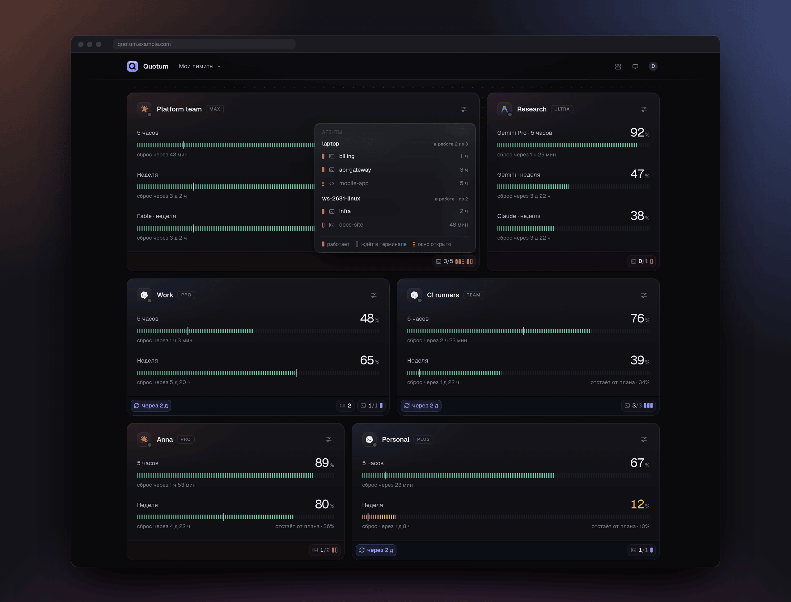
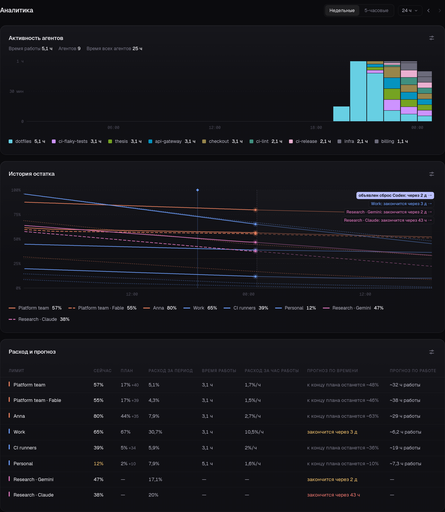
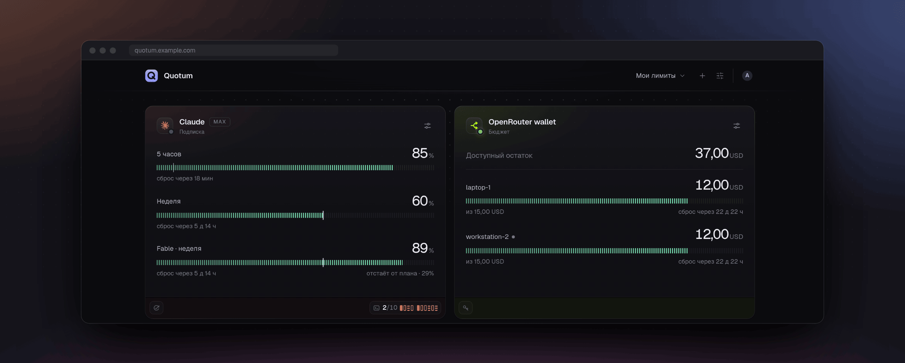

# Quotum

[English](README.md) · **Русский**

[](https://github.com/padurets/quotum/releases/latest)
[](https://www.npmjs.com/package/quotum)
[](https://github.com/padurets/quotum/actions/workflows/ci.yml)
[](LICENSE)

Quotum показывает, сколько осталось от подписок на кодинг-агентов — Claude Code, Codex
и Antigravity — на всех машинах, где вы работаете, в одном месте: для вас одного или
для всей команды. Также он показывает баланс OpenRouter и лимиты API-ключей, баланс DeepSeek и квоты личной подписки z.ai.
Он работает на вашем сервере: агент не читает токены провайдеров, а хаб шифрует
отдельный ключ провайдера, который вы явно подключаете.



Для одной машины [скачайте десктопное приложение](#десктопное-приложение) для Windows
или Linux: хаб и аккаунт настраивать не нужно. Для нескольких машин или команды
запустите хаб и агент, как показано ниже.

**Быстрый старт**

```sh
# Хаб; `docker logs quotum` покажет код для первого аккаунта
docker run -d --name quotum -p 8080:8080 -v quotum:/data -v quotum-keys:/keys ghcr.io/padurets/quotum-hub

# На каждой машине: подтвердите код в браузере, затем агент мерит в фоне
npx quotum connect http://<хаб>:8080
npx quotum start
```

Просто `npx quotum` покажет лимиты этой машины без всякого хаба. Подробнее — в разделе
[Как запустить](#как-запустить).

## Зачем я это сделал

Я плачу сразу за несколько кодинг-агентов, и у каждого свои лимиты: пятичасовое окно,
недельное, иногда ещё отдельное недельное под конкретную модель. Чтобы понять, где я
нахожусь, приходилось открывать каждый инструмент, набирать `/usage` и прикидывать в
уме: если так пойдёт дальше, хватит ли недельного лимита до выходных? К тому же я
работаю не на одной машине: есть ноутбук, несколько удалённых dev-окружений и
контейнеры, и одни и те же подписки залогинены сразу на нескольких.

Мне нужна была одна страница, которая отвечает на мои реальные вопросы:

- сколько осталось в каждом окне и когда оно сбросится;
- не трачу ли я быстрее, чем планировал на эту неделю;
- как это выглядело последние дни.

Сначала я поискал готовое. Всё, что нашлось, либо живёт на одной машине (сам дашборд
поначалу брал данные из [CodexBar](https://github.com/steipete/CodexBar), хорошего
приложения для строки меню macOS), либо просит токены провайдеров или cookies браузера,
чтобы ходить в их API от вашего имени. Первое не подходило под то, как я работаю, а
второго делать не хотелось. Поэтому я написал Quotum.

## Как это устроено

Две части:

- **Агент** — маленькая нативная программа (Rust, один бинарник около 3 МБ). Он
  работает на каждой машине, где вы пользуетесь кодинг-агентами, и спрашивает лимиты у
  их собственных консольных клиентов — те же цифры, что вы видите по `/usage`. Он не
  читает токены, не делает запросов к моделям и сам не ходит в API провайдеров: клиент
  делает ровно то же, что и когда им пользуетесь вы.
- **Хаб** — небольшой веб-сервис (Node.js и SQLite) с дашбордом. Агенты присылают ему
  замеры, он хранит историю и рисует её.

```
 ноутбук ──┐
 dev VM  ──┼── агент quotum ── HTTPS ──►  хаб  ──►  дашборд
 сервер  ──┘   claude · codex · agy       SQLite
```

Если одна подписка залогинена на нескольких машинах, мерят её не все. Хаб назначает на
каждую подписку одну дежурную машину (по возможности ту, за которой вы сейчас
работаете), остальные ждут, а если дежурная замолкает, дежурство переходит к другой.

Агент работает и сам по себе: `npx quotum` печатает лимиты этой машины и запущенных на
ней агентов: работают они или простаивают.

```
$ npx quotum
                                   left  resets
Codex pro     weekly                 4%  in 3d 16h
              free resets            1   expires in 29d 23h
Claude max    5 hours               98%  in 4h 27m
              weekly                89%  in 5d 9h
              Fable weekly         100%  in 5d 9h
Antigravity   Gemini 5 hours       100%  in 4h 59m
              Gemini weekly         96%  in 1d 3h

running here: 3 · 2 working
Claude        quotum               working  started 3h 39m ago
Claude        quotum · quotum.feat-18 working  started 52m ago
Codex         api                  idle     started 25m ago · editor
```

## Что показывает дашборд

- **Карточка на каждую подписку**, по шкале на окно: зелёная выше 30%, жёлтая от 30% и
  ниже, красная меньше 10%. Засечка на шкале показывает, где вы должны быть сейчас по
  плану расхода. Точка на логотипе провайдера говорит, свежие ли цифры.
- **Какие агенты на ней запущены и какие работают.** Под лимитами — метка на каждую
  сессию Claude Code, Codex или Antigravity, которая тратит эту подписку, по машинам:
  залитая, пока работает, контурная, пока простаивает; в подсказке проект, папка
  (worktree, папка внутри репозитория) и учтённое время её работы в агенто-часах.
  Это время зачтено текущей подписке; без достоверного ID сессии оно неизвестно:
  прочерк отличает его от известного нуля. Терминалы, редакторы и приложение Codex —
  одинаково.
- **Купленные кредиты Codex.** Дополнительные средства видны в футере подписки рядом
  с бесплатными сбросами; в компактном виде — такая же сумма с раскрытием деталей.
  Начальная оценка — 0,04 USD за кредит; в «Валютах» можно задать личный курс
  или вернуть исходный.
  Наведение на сумму показывает точный исходный баланс в кредитах, нажатие — курс
  и время замера.
  **«Динамика дополнительных средств подписок»** показывает историю баланса в отдельном
  виджете со своим выбором подписок. Он также доступен через **+** на доске.
  У бюджетов кошельков остаются отдельные график и таблица.
  Для общей доски нужно отдельно разрешить показ средств и последующей истории. Изменение баланса
  не считается доказательством расходов или пополнений.
- **Бесплатные сбросы.** Когда провайдер выдаёт сбросы лимитов (Codex время от времени
  так делает), на карточке видно, сколько их у вас и до какого числа.
- **План расхода на неделю.** По умолчанию 30 / 25 / 15 / 15 / 10 / 5% на шесть дней
  после сброса, на седьмой ничего. У каждой подписки план можно настроить свой: 0 —
  день без трат, и это может быть любой день недели.
- **Отдельные графики и показатели лимитов подписки и бюджета**: каждый виджет можно перемещать,
  растягивать и скрывать. У них общий интервал с активностью агентов; переключатель
  недельных и сессионных периодов влияет только на лимиты подписки. Бюджет открывается на остатках,
  расходы включаются в настройках графика.
- **График недельных или пятичасовых окон** за последний час и дальше, до 30 дней.
  Справа от «сейчас» видны план, куда идёт каждое окно (недельное — почти ровно в часы,
  когда подписка обычно не тратит) и ближайшие сбросы, насколько далеко — выбираете вы;
  слева отмечено, когда лимиты вернулись досрочно и когда выдали бесплатные сбросы.
  Протяните по графику, чтобы приблизить всплеск работы (на телефоне сначала задержите
  палец). ‹ и › листают его на половину длины; горизонтальный свайп тачпада,
  колесо с Shift или перетаскивание с Shift непрерывно двигают вместе графики активности,
  лимитов, бюджетов и дополнительных средств подписок.
  Открытая страница хранит уже прочитанную историю и запрашивает только недостающие
  или изменившиеся части при новых замерах и отчётах о работе агентов.
- **Таблица с двумя прогнозами:** сколько потрачено за период, время активности
  на каждой подписке и во что обходится час активности; если включить — агенто-часы
  (каждый агент отдельно) и долю расхода, пришедшуюся на их работу (всё, что ушло мимо, в claude.ai или с телефона,
  делает час активности дороже). Дальше — к чему это ведёт. По времени: хватит ли окна до
  сброса и когда примерно оно закончится или сколько примерно останется; этот прогноз
  одинаков на любом периоде. Недельное окно — по тому, как тратит подписка: в те часы и
  дни, когда она обычно тратит, сквозь сбросы, на уровне последних суток; стрелка
  отмечает последние часы быстрее обычного. Пятичасовое — по темпу с начала окна.
  По работе: на сколько примерно часов активности хватит остатка. Для промежутка,
  выделенного на графике, — во что он обошёлся: сколько оставалось в начале и в конце,
  сколько потрачено всего и за час и сколько работали агенты.
- **Активность агентов:** агенто-часы за тот же период, стопками по подписке, проекту
  или машине в столбиках до часа (на 30 днях — по два часа). Четыре агента за час дают
  4 агенто-часа: легенда складывается в итог. Время активности (работает хотя бы один
  агент), число агентов и среднее одновременно — в итогах и подсказках. Приближается
  и листается по времени так же, как график.
- **Объявления о сбросах** из общественных трекеров [Codex Resets](https://codex-resets.com)
  и [Claude Resets](https://claude-resets.com), со ссылкой на источник. Их можно
  выключить.
- **Доска из виджетов** (карточка на каждую подписку, активность агентов, график,
  таблица и включаемый список запущенных агентов, сгруппированных по проекту, машине или
  подписке: у каждой группы — сколько её агентов работает, их агенто-часы и дата и время
  последней активности, либо «сейчас», пока кто-то работает; сами агенты с их машинами
  и подписками — по клику), как дашборд в Grafana: карточки
  показывают, сколько осталось сейчас, а аналитика под ними делит одни фильтры. Владелец
  доски расставляет их на сетке из шести колонок, перетаскивая за шапку, и меняет ширину:
  треть, половина, две трети или вся сетка. Каждый занимает столько рядов, сколько нужно
  его содержимому, поэтому карточки стоят стопкой рядом с высоким списком, если только
  владелец не потянет за нижний край (или нижний угол), чтобы сделать виджет выше, а
  список агентов — короче: графики растут вместе с виджетом, карточка не становится ниже
  своего содержимого, а укороченный список заканчивается строкой о том, сколько в нём
  ещё строк, и открывает их все. Любой боковой край меняет ширину. Двойной щелчок по
  нижнему краю или нижнему углу, Enter или пробел на нижнем крае возвращают виджету
  высоту по содержимому. Владелец
  называет карточки, прячет ненужные (данные при этом продолжают собираться) и задаёт планы; все участники видят доску одинаково.
  Когда всё настроено, замок не даёт виджетам сдвинуться от случайного движения мыши.
- **Выбор частоты замеров.** В меню подписки выберите **Авто** или каждые
  **1, 2, 5 или 15 минут**. Настройка общая для всех досок с этой подпиской и сохраняется
  после рестарта хаба. Менять её может тот, чьи устройства измеряют подписку;
  одного владения доской недостаточно. Интервал устройства остаётся его минимумом
  и может делать замеры реже. Ручное обновление и паузы после ошибок сохраняются.
- **Свежие лимиты по запросу.** Выберите **Обновить данные** в меню карточки или
  **Обновить все данные** в меню **Управление доской** в шапке для всех видимых карточек доски.
  Открытие меню показывает последнее измерение и ошибки; обновление требует явного нажатия.
  Круглый индикатор у
  логотипа показывает, что карточка ждёт свежие цифры. Обновление соблюдает интервал
  устройства и паузы после ошибок. На подписку принимается один новый запрос в минуту;
  действие доступно каждому читателю общей карточки.
- **Ваши данные, и делитесь ими вы сами.** Всё, что меряют ваши машины, есть на вашей
  личной доске. На общей доске команда видит лимиты, которыми с ней поделились
  участники: каждый сам решает, какие из своих подписок туда выложить. Командная
  подписка, которую меряют несколько человек, — одна карточка.

Интерфейс есть на английском и русском.



## На что я обращал внимание

Это пет-проект, но мне хотелось инструмент, который не страшно держать запущенным на
каждой машине весь день, а не скрипт, собранный на коленке за выходные. На деле это
значит вот что.

- **Не мешает.** В простое агент занимает около 5 МБ памяти. Дорого здесь другое —
  запуск клиента агента (около секунды процессора и 100–230 МБ памяти на эту секунду),
  поэтому Quotum запускает их как можно реже. Клиенты работают строго по одному, и
  каждую подписку мерит только одна машина, так часто, как говорит хаб: он видит
  подписку на всех машинах. Раз в две минуты, пока ею где-то пользуются или меняются
  цифры; когда осталось мало — раз в минуту, пока она активна, а если часами тихо, раз
  в две и затем в пять минут; и реже, пока ничего не происходит, вплоть до раза в 15
  минут. Машина на дежурстве спрашивает хаб раз в 15 секунд, это ничего не запускает.
- **Доступы клиентов остаются на месте.** Агент никогда не читает, не хранит и не отправляет
  токены провайдеров или cookies. С машины уходят проценты и время сбросов, переданные
  Codex балансы кредитов и доступность ресурсов, названия тарифов,
  необратимый хеш идентификатора каждого аккаунта (чтобы хаб понимал, что две
  машины сидят на одном аккаунте), имя машины и её случайный id, при сбое — короткое
  сообщение клиента, а ещё какие агенты запущены на машине: работают ли, с какого
  времени, как называются их проект (git-репозиторий, в котором лежит их папка, иначе
  сама папка) и папка (`sessions = false` и `projects = false` это отключают). С каждым
  вопросом хабу — пользуются ли клиентом на машине: карточка говорит участникам своих
  досок, что подпиской сейчас пользуются, как бы ни стояли эти настройки.
  Если доска показывает эту подписку, кто бы её ни добавил, и человек, чьи это агенты,
  состоит в доске, её участники видят этих агентов с именем машины, каждый проект — под
  тем именем, что дал ему этот человек, а ещё когда и сколько агенты работали, по
  проектам и машинам, — с того, что позже: когда этот человек вступил в доску или когда
  подписка появилась на ней (на своей личной доске — всё). Хаб хранит, когда работал
  каждый агент, с именами его машины, проекта и папки, 90 дней, а имена, которые вы
  дали проектам, — пока вы их не вернёте; свои проекты вы видите и правите через «Активность агентов → Настройки →
  Управлять проектами». Полный список — в [спецификации](spec/ingest-v1.md#privacy).
- **Цифрам можно верить.** Расходом считается только реальный рост внутри одного окна
  сброса. Сбросы, поправки провайдера и пропуски в данных никогда не превращаются в
  «потраченное». Агент сообщает, когда будет следующий замер, поэтому редкие замеры не
  принимаются за пропуск.
- **Мало движущихся частей.** У агента девять прямых зависимостей. Хаб — это Fastify и
  встроенный в Node SQLite, интерфейс — обычный React, около 244 КБ JavaScript в gzip.
  Телеметрии нет. Хаб читает два трекера сбросов (или указанное вами зеркало) раз в
  десять минут; `QUOTUM_RESETS=off` это выключает. При подключении OpenRouter, DeepSeek
  или z.ai он также читает их балансы или квоты фиксированными HTTPS-запросами с
  переданными вами отдельными ключами. Для пересчёта валют используются публичные
  справочные курсы; личные балансы и курсы не отправляются сервису курсов.
- **Описано и проверено.** Протокол между агентом и хабом оформлен как спецификация
  ([spec/ingest-v1.md](spec/ingest-v1.md)). Тесты проверяют правила расхода,
  сбросы, дежурство, расписание, права, общий доступ, подключение устройств, разбор ответов клиентов
  и переводы. TypeScript строгий, Rust проходит `clippy`.

## Статус

Работает: я пользуюсь им каждый день. Агент ставится одной командой или запускается
через npm как `quotum`, с готовыми бинарниками для Linux (x64 и arm64, любой
дистрибутив), macOS и Windows; хаб — это Docker-образ (`ghcr.io/padurets/quotum-hub`,
amd64 и arm64). [Десктопное приложение](#десктопное-приложение) для Windows и Linux
объединяет агент, хаб и доску на одной машине. Автообновление приложения и регистрация
агента как сервиса ещё впереди ([планы](#планы)).

- Клиенты: Claude Code, Codex CLI, Antigravity CLI (`agy` 1.1.11 или новее).
- Платформы: сам я запускаю на Linux. Бинарники для macOS и Windows собраны
  кросс-компиляцией и пока почти не обкатаны — issues приветствуются.

## Как запустить

**1. Запустите хаб.**

```sh
docker run -d --name quotum --restart unless-stopped -p 8080:8080 -v quotum:/data -v quotum-keys:/keys ghcr.io/padurets/quotum-hub
docker logs quotum            # покажет код установки для первого аккаунта
```

Откройте `http://<эта машина>:8080` и создайте первый аккаунт с этим кодом: пока на хабе
нет ни одного аккаунта, занять его может только тот, кто видит его лог. Больше ничего
настраивать не нужно. Для HTTPS на собственном домене
[deploy/compose.yaml](deploy/compose.yaml) ставит хаб за Caddy, который сам получает
сертификат: `QUOTUM_DOMAIN=quotum.example.com docker compose up -d`.

Без Docker: склонируйте репозиторий, затем `cd hub && npm ci && npm run build && npm start` (Node.js 24 или новее) —
хаб слушает `127.0.0.1:8080` и печатает код установки в терминал.

**2. Поставьте агент и посмотрите лимиты этой машины.**

```sh
curl -fsSL https://github.com/padurets/quotum/releases/latest/download/install.sh | sh    # Linux, macOS
irm https://github.com/padurets/quotum/releases/latest/download/install.ps1 | iex         # Windows (PowerShell)
quotum
```

Установщик кладёт `quotum` в `~/.local/bin` (в Windows — в
`%LOCALAPPDATA%\Programs\quotum` и добавляет его в PATH), сверив с контрольными суммами
релиза; `QUOTUM_INSTALL_DIR` и `QUOTUM_VERSION` меняют, куда и какую версию. `quotum update`
держит его свежим: когда нового нет, это один маленький запрос, так что dev-окружение
может запускать его при каждом старте. С Node.js 18 или новее `npx quotum` работает без
установки, а обновляет его npm.

**3. Подключите машину к хабу и оставьте её мерить.**

```sh
quotum connect http://127.0.0.1:8080
quotum start
```

`connect` покажет код: подтвердите его в браузере, и машина станет вашей; то, что она
меряет, появится на вашей доске. `start` продолжает мерить и отправлять в фоне, с логом
в каталоге состояния; `quotum` покажет, работает ли агент, а `quotum stop` остановит
его. После перезагрузки машины он сам не поднимется: для этого пусть система запускает
`quotum run` — то же самое на переднем плане (пользовательский сервис systemd, launchd,
автозапуск Windows). С npx ставьте `npx` перед каждой командой.

**Много машин сразу** (образы, виртуалки, контейнеры): создайте токен машин в дашборде
(*Настройки → Устройства → Токены устройств*) и запускайте с ним каждую машину — она сама подключится как
ваша:

```sh
QUOTUM_HUB_URL=https://quotum.example.com QUOTUM_HUB_TOKEN=qt_m_… quotum run
```

В dev-окружении, которое часто стартует (Coder, Codespaces, devcontainer), скрипт старта
может обновить агент и запустить его в фоне:

```sh
quotum update || true         # быстро, когда нового нет; без сети сдаётся за секунды
QUOTUM_HUB_URL=https://quotum.example.com QUOTUM_HUB_TOKEN=qt_m_… quotum start
```

Токен машин принадлежит одному человеку: каждый в команде создаёт свой. Имена машинам
дают в *Настройках → Устройствах*, так что образу не нужно отдельное имя для каждой копии.

**Общая доска для команды.** Создайте общую доску и пригласите людей по ссылке из
*Управления доской → Участники*. Поделитесь своими подписками через меню *Добавить виджет*
на доске. В *Настройках доски → Предоставленные данные* можно в любой момент убрать свою
подписку; владелец доски может убрать с неё любой предоставленный источник.

**Вручную:** в каждом [релизе](https://github.com/padurets/quotum/releases) есть агент для
Linux, macOS и Windows архивом (`quotum-cli-<версия>-<платформа>`, с лицензиями) и голым
бинарником (`quotum-cli-<платформа>` — его берут установщики и `quotum update`), с
контрольными суммами (`SHA256SUMS`) и
[подтверждением сборки](https://docs.github.com/en/actions/security-for-github-actions/using-artifact-attestations)
(`gh attestation verify <файл> -R padurets/quotum`). **Из исходников:**
`cd agent && cargo build --release` (Rust 1.85 или новее) даёт `target/release/quotum`.

## Подключение DeepSeek

В **Моих подключениях** выберите **Подключить → DeepSeek** и введите отдельный API-ключ
из [настроек ключей DeepSeek](https://platform.deepseek.com/api_keys). Задайте приватное
имя аккаунта или явно переподключите существующий. DeepSeek не возвращает ID аккаунта:
его идентичность указываете вы, а замена ключа требует подтверждения, что он относится
к тому же аккаунту. Удаление доступа сохраняет эту идентичность и оставшуюся историю.
Другой аккаунт подключается отдельно. Обычный API-ключ может разрешать запросы к моделям;
Quotum использует только фиксированное [чтение баланса](https://api-docs.deepseek.com/api/get-user-balance/).
Срок ключа неизвестен, и его сохранение требует явного согласия. Серверный и настольный
режимы используют одинаковую защиту зашифрованного доступа из [SECURITY.md](SECURITY.md).

Карточка и компактная панель используют общий с OpenRouter вид бюджета: один
**Доступный остаток** в вашей валюте отображения, затем доступные ограничения. У DeepSeek нет шкал лимитов.
USD — начальная валюта отображения. В **Настройки → Валюты** можно выбрать стандартную
валюту или создать личную единицу со своими курсами. Выбор применяется к денежным
карточкам, компактной панели, таблицам и графикам на всех досках независимо от других
читателей. Можно менять название и точность, добавлять датированные версии курсов,
архивировать и восстанавливать валюту. Для архива выбранной валюты нужна замена.
Сохранённые оценки сохраняют прежний курс; недоступный пересчёт отличается от нуля. Сообщённая опорная
валюта имеет приоритет. Для ответа только в CNY общий валютный сервис hub сохраняет отдельную
оценку в USD по [дневным справочным курсам ЕЦБ](https://www.ecb.europa.eu/stats/policy_and_exchange_rates/euro_reference_exchange_rates/html/index.en.html),
помеченную **≈**. Состав открывается по нажатию на сумму остатка; для оценки также
указаны исходная сумма в CNY и дата курса. Исходное измерение сохраняется до запроса
курса; общий кэш курсов переживает перезапуск и не содержит ключей или данных аккаунта.
Историческая оценка сохраняет использованный курс. Без подходящего курса CNY
сохраняется, а USD остаётся неизвестным или устаревшим.
Все исходные балансы, оценки, данные курса, статус средств и безопасные данные
поставщика сохраняются в пределах срока хранения истории. История и таблица бюджета
появляются рядом с аналитикой подписок. По умолчанию выбраны общие балансы,
а составляющие добавляются в настройках графика. Общий баланс не складывается с
составляющими. Сообщённый USD и пересчитанный CNY не суммируются. Расходы и события пополнения
**недоступны**: у этого endpoint нет счётчика расходов, а изменение баланса их не
доказывает. Отсутствующая валюта сохраняет последнее число как устаревшее и прерывает
историю до следующего корректного наблюдения. Ошибка запроса сохраняет последнее
корректное измерение. Сообщение поставщика о недостатке средств отличается от отказа
в доступе. Сохранённый доступ и приватные имена аккаунтов видит только владелец,
в том числе на общей доске. Обновлять источник могут только его держатели.

## Подключение OpenRouter

На выбранной доске откройте **Добавить виджет** (+) в шапке, затем **Подключить** → **OpenRouter**.
Создайте отдельный management key в
[настройках управляющих ключей OpenRouter](https://openrouter.ai/settings/management-keys)
и вставьте его в поле пароля. **Подключить и добавить** проверит ключ, сохранит ваш
доступ и покажет баланс на этой доске одним действием. Ключи без срока поддерживаются
без второго подтверждения. На общей доске форма заранее объясняет, какие данные
увидят её участники.
Ключ может создавать, изменять и удалять API-ключи провайдера; Quotum использует
только фиксированные операции чтения. Новый сервер сам создаёт отдельный постоянный
ключ шифрования, а его оператор может расшифровать сохранённый доступ. Защита и её
границы описаны в [SECURITY.md](SECURITY.md).

Аватар открывает страницы профиля, подключений, устройств, проектов и интерфейса.
Настройки доски относятся к выбранной доске. Добавление показывает только отсутствующие
или скрытые виджеты, которые вам разрешено добавить; замок переключает свободное
изменение и блокировку расположения. Логотип Quotum возвращает на выбранную доску
с её временным диапазоном. Подключение из **Настройки → Мои подключения**
остаётся личным до явного выбора доски. Существующий доступ используется повторно;
замена ключа — отдельное действие. **Недавние добавления и восстановление** позволяет
найти сохранённый результат после потери ответа или перезагрузки, без дубликата доступа
и без восстановления позднее скрытой или удалённой карточки.

Название тарифа остаётся рядом с заголовком; маленькая вторая строка указывает тип
ресурса: **Подписка** или **Бюджет**. Бюджет показывает только актуальное состояние:
баланс и включённые лимиты ключей со сроками сброса. В настройках включаются и
выключаются отдельные шкалы, включая ключи за пределами исходного превью из пяти.
Шкалы используют тот же компонент, что подписки; у ключей без лимита шкалы нет.
Расход относится к разделу аналитики.
В настройках не более десяти ключей на страницу. Жёлтая метка появляется за семь суток
до истечения срока доступа; истёкший, отозванный или запрещённый доступ отмечается красным.
У работающего бессрочного ключа нет метки срока. Временная ошибка обновления отмечается жёлтым.
Расход ключей и остатки лимитов для аналитики выбираются в настройках самого графика.
История и таблица бюджета — отдельные виджеты рядом с аналитикой лимитов подписки.
По умолчанию выбраны балансы аккаунтов; одновременно выводится не более 32 рядов,
а превышение обозначается. На оси одна единица, временной диапазон и жесты общие
с историей подписок. У кошелька нет процента; он есть только у положительного
лимита ключа.

Пополнение учитывается отдельно: расход берётся из накопительного счётчика usage.
До первого измерения история неизвестна. Неполная история и расход после пропуска
сохраняют отметку неопределённости и исходный интервал. Имена ключей и денежные
измерения видят участники общей доски, детали сохранённого доступа — только владелец.
Обновлять источник, измеряемый хабом, могут только его держатели. Заменяйте или удаляйте
сохранённый доступ в **Настройки → Мои подключения**; удаление не отзывает ключ у провайдера.
Отзыв или истечение срока сохраняют последние измерения. Компактная панель тоже
показывает деньги, а минимум в трее и уведомления о квотах используют только проценты.



## Подключение z.ai Personal

Откройте **Мои подключения**, выберите **Подключить**, затем **z.ai Personal (Global)**.
Создайте отдельный ключ для Quotum в [настройках ключей z.ai](https://z.ai/manage-apikey/apikey-list).
Обычный API-ключ может также разрешать запросы к моделям; Quotum только читает квоты
личной подписки Global Coding Plan через операцию из
[официального usage plugin](https://docs.z.ai/devpack/extension/usage-query-plugin).
Поставщик не сообщает срок действия ключа, поэтому сохранение требует явного согласия.
Оператор серверного хаба может расшифровать доступ; десктоп использует защищённое
хранилище ключей приложения. Удаление доступа не отзывает ключ у поставщика.

Карточка **Подписка** и компактная панель показывают независимые остатки пятичасовой
и недельной квот в процентах, с теми же строками и названиями периодов, что у остальных
подписок. Точные кредиты и переданные лимиты доступны в подсказке значения, а время
сброса — под шкалой. Неизвестный сброс остаётся
неизвестным. Поддерживается текущее поколение кредитных квот; прежние prompt/token/MCP
и неизвестные форматы недоступны. Это опубликованный поставщиком интерфейс плагина
без версионированной OpenAPI-схемы квот. Некорректные или отсутствующие данные сохраняют
последние значения, не обновляя их свежесть. Остаток квоты не гарантирует доступность
модели или свободные параллельные запросы.

Обе квоты также входят в обычный график и таблицу подписок: выберите **5-часовые** или
**Недельные**, вместе с остальными подписками. Легенда графика, цвета источников,
временной диапазон и видимость периодов общие. Исторические проценты используют лимит,
переданный при каждом измерении. Квоты перекрываются и не складываются, не переводятся
в деньги. Прогнозы, привязка работы агентов и нативные уведомления о квотах для этого
поставщика недоступны. Пропуски и устаревшие показания остаются неизвестными в истории.
Обновлять источник и менять частоту могут только его держатели.

Каждое новое подключение создаёт отдельный источник своего владельца. Замена ключа
требует подтверждения того же аккаунта и сохраняет историю; интерфейс квот не проверяет
эту декларацию. Другой аккаунт подключайте отдельно. На общей доске детали доступа
видит только владелец.

## Обновление

Перед заменой хаба остановите его и сохраните копию каталога данных (в примерах это
Docker volume `quotum`). Запустите новый образ с тем же volume: база мигрирует
автоматически. Для отката нужны старый образ и копия данных до обновления:
старый хаб откажется открывать более новую схему базы.

При переходе с хаба версии ниже 0.4 замеры подписок, доски и настройки сохраняются.
Прежние суммы работы агентов заменяются историей отдельных сессий: время работы и прогнозы на его
основе будут доступны с момента обновления. История лимитов до обновления остаётся
на графике.

При переходе с 0.4 замеры подписок, история работы агентов, доски и настройки
сохраняются. Раскладки досок, сохранённые до появления сетки виджетов, преобразуются
при открытии. После обновления перезагрузите открытые вкладки доски, чтобы страница
и хаб использовали один контракт истории.

При переходе с 0.5 замеры подписок, история работы агентов, доски и настройки также
сохраняются. Для замеров подписок новая конфигурация не нужна. Чтобы подключить
OpenRouter к серверному хабу, настройте отдельный ключ шифрования по
[deploy/README.md](deploy/README.md) и сохраняйте его резервную копию отдельно от
данных. Десктопное приложение управляет своим ключом, как описано в
[SECURITY.md](SECURITY.md).

При переходе с 0.6 замеры, история работы агентов, доски, настройки и зашифрованные
подключения сохраняются. Прежние виджеты аналитики становятся отдельными виджетами
лимитов и бюджетов с сохранением выбранных настроек. Исходная валюта отображения — USD;
другую валюту и личные курсы можно задать в **Настройки аккаунта → Валюты**.
Купленные кредиты Codex появятся после обновления агента и следующего замера.
Общий доступ к подписке не открывает её дополнительные средства: разрешите это
отдельно на каждой общей доске. После обновления перезагрузите открытые вкладки доски.

На каждой машине выполните `quotum update`, затем перезапустите фонового агента через
`quotum stop` и `quotum start` (или перезапустите его сервис). Для npm используйте
последнюю версию пакета `quotum`. Сначала обновите хаб: старые агенты по-прежнему
передают ему замеры, а новые следуют его расписанию.

## Десктопное приложение

Для одной машины есть приложение для Windows и Linux (macOS — позже): агент этой машины,
свой хаб и доска в окне, иконка в трее. Без аккаунта и сервера.
Скачайте его из [Releases](https://github.com/padurets/quotum/releases/latest):

| Система | Пакет |
|---|---|
| Windows x64 | `quotum-desktop-<version>-windows-x64-setup.exe` или `…-windows-x64-portable.zip` |
| Linux x64 | `quotum-desktop-<version>-linux-x64.deb`, `.rpm` или `.AppImage` |

Для этих пакетов в релизе тоже есть `SHA256SUMS` и build provenance.
[Desktop workflow](.github/workflows/desktop.yml) собирает и проверяет те же пакеты
на каждом PR и в `main`; артефакты промежуточных сборок дополнительно содержат
коммит в имени. Как собрать самому — в [CONTRIBUTING.md](CONTRIBUTING.md).

- **Windows 10 и 11:** запустите `quotum-desktop-<версия>-windows-x64-setup.exe`. Он ставит приложение
  только для вас, в `%LOCALAPPDATA%\Quotum`, без прав администратора, и сам поставит
  WebView2, если его в Windows нет. Установщик пока не подписан, поэтому сначала
  спросит SmartScreen: *Подробнее → Выполнить в любом случае*.
  Или распакуйте portable ZIP и запустите `Quotum/quotum-desktop.exe` без установки.
  Сохраняйте всю распакованную папку целиком. Данные и настройки остаются в вашем
  профиле Windows и общие с установленным приложением; рядом с EXE они не записываются.
  Для portable нужен установленный [Microsoft Edge WebView2 Runtime](https://developer.microsoft.com/microsoft-edge/webview2/)
  (setup.exe при необходимости устанавливает его сам).
- **Linux** (x64): пакеты включают Chromium и Node.js.
  На Debian 12, Ubuntu 22.04 и новее — `sudo apt install ./quotum-desktop-<…>.deb`,
  на Fedora — `sudo dnf install ./quotum-desktop-<…>.rpm`. В остальных системах сделайте
  AppImage исполняемым (`chmod +x`) и запустите; в системе нужны GTK3 и NSS.
  Если FUSE недоступен, добавьте
  `--appimage-extract-and-run`. Для песочницы Chromium в AppImage нужны непривилегированные
  пространства имён пользователей; если система их ограничивает, используйте нативный
  пакет. На NVIDIA приложение выбирает X11/XWayland, когда он доступен. При проблемах с
  графикой полностью выйдите и попробуйте `quotum-desktop --software-rendering` (или
  добавьте параметр к команде AppImage). Он действует только на этот запуск. Закрытие
  окна освобождает Chromium; замеры и трей продолжают работать в небольшом Rust-контроллере.

Перед проверкой новой сборки выберите *Выйти* в старой: закрытие окна оставляет её
работать, а повторный запуск открывает тот же процесс. Проверьте коммит в настройках;
запись автозапуска AppImage тоже должна указывать на нужный файл.

Приложение откроет свою доску, первые цифры появятся в течение минуты. Шестерёнка
открывает настройки: какие провайдеры мерить и как часто, запущенные агенты, запуск при
входе в систему, версия и *Выйти*. Настройки замеров общие с `quotum`
([Настройки](#агент)); уведомления и язык принадлежат приложению.

- **Закрытое окно** не останавливает замеры. Полную доску открывает пункт «Открыть Quotum»
  в меню трея или повторный запуск приложения. *Выйти* есть в настройках и в меню иконки. GNOME
  показывает иконки трея только с расширением (AppIndicator); без него откройте окно
  повторным запуском приложения.
- **Лимиты в трее.** Иконка следует за наименьшим видимым остатком: зелёная выше 30%,
  жёлтая от 10% до 30% включительно, красная ниже 10%. Отдельная отметка означает
  устаревшие или недоступные замеры; отсутствие цифр не означает полную квоту.
  Щелчок по иконке в Windows или пункт «Лимиты» её меню в Linux открывает компактную
  панель с теми же лимитами, сроками сброса и работающими агентами, что на доске.
  Escape и потеря фокуса закрывают панель.
- **Уведомления** сообщают о низком и критическом остатке, подтверждённом замером
  сбросе окна и новом объявлении запланированного сброса из общественных трекеров.
  У каждого вида свой переключатель; изначально все включены. Скрытые карточки и окна
  исключены. Каждый порог уведомляет один раз за подтверждённый цикл; скачок сразу
  в критический остаток даёт только критическое уведомление. После запуска,
  пробуждения и восстановления связи пропущенные события не воспроизводятся.
  Пропуски замеров и неоднозначные коррекции провайдера могут скрыть сброс; одного
  таймера для подтверждения недостаточно. Настройки ОС и «Не беспокоить» могут
  подавить показ. Приложение не запрашивает звук. Portable в Windows использует ту же
  системную доставку, что установленная версия. Отсутствие трея или службы уведомлений
  в Linux не останавливает замеры.
- **Запуск при входе** включается сам, когда приложение впервые меряет, и запускает его
  без окна. Выключается в настройках — сделайте это и перед удалением. Запись называет
  AppImage или portable EXE Windows по пути: держите его на месте (после переноса
  выключите и снова включите запуск при входе).
- **Обновления ставятся вручную.** Скачайте новый релиз и выйдите из приложения,
  прежде чем устанавливать его поверх старого. Для portable
  замените всю распакованную папку; данные останутся в вашем профиле Windows.
- **Вместе с `quotum`.** Машину меряет один агент. Если её уже меряет `quotum`,
  приложение один раз спросит, забрать ли замеры себе. `quotum` этой версии тогда ждёт
  и сам продолжает, когда приложение закроется, так что `quotum run` как сервис
  продолжает работать; более старый останавливается (обновите его). Хаб, в который
  отправлял `quotum`, пока работает приложение, ничего от этой машины не получает.
- **Его данные**, включая историю доски, лежат в `%LOCALAPPDATA%\com.padurets.quotum`
  или `~/.local/share/com.padurets.quotum`.
  Логи лежат в `%LOCALAPPDATA%\com.padurets.quotum\logs` на Windows и
  `~/.cache/com.padurets.quotum/logs` на Linux.
- **Сеть:** приложение читает объявления о сбросах у Codex Resets и Claude Resets,
  как любой хаб (`QUOTUM_RESETS=off` в окружении приложения это выключает). Если вы
  подключите OpenRouter, DeepSeek или z.ai, хаб также читает их балансы или квоты через
  фиксированные HTTPS-запросы с переданными вами отдельными ключами. Для пересчёта валют
  он получает публичные справочные курсы, не отправляя балансы и личные курсы. Локальный хаб слушает только
  `127.0.0.1`, за ключом, который есть только у окон приложения; замеры на серверный
  хаб он не отправляет.
- **Размер:** пакеты Linux несут Chromium для окна и Node.js для хаба.
  Windows использует системный WebView2: около 27 МиБ для setup.exe или 39 МиБ для ZIP.
  В Windows 11 ВМ с пятью подписками суммарный working set приложения, Node и WebView2
  в простое составил около 342 МиБ с окном и 47 МиБ после его закрытия;
  CPU — 0,76% и 0,24% одного ядра за 30 секунд. Память зависит от истории,
  WebView2 и Windows; виртуальная графика не подтверждает плавность на физическом дисплее.

## Настройки

### Агент

Всё необязательно. На Linux файл лежит в `~/.config/quotum/config.toml`;
`quotum config` покажет, где он в вашей системе и что сейчас действует.

```toml
# interval = 120        # секунд, от 60 до 86400: с хабом — не чаще этого (без строки — частота
                        # подписки на хабе); без хаба — как часто мерить
eco = true              # без хаба (или пока он не отвечает): мерить реже, пока ничего не меняется
sessions = true         # сообщать хабу, какие агенты здесь запущены и работают ли
projects = true         # вместе с именами их проектов и папок

[machine]
name = "work-laptop"    # имя, которое машина сообщает (по умолчанию — имя хоста); имя, данное в хабе, важнее

[hub]
url = "https://quotum.example.com"
token = "qt_m_…"

[clients.opencode]
enabled = true          # учитывать работу независимо от измерений подписки
route = false           # согласие на будущие наблюдения маршрута (пока не собираются)
# path = "/opt/opencode/bin/opencode"

[providers.antigravity]
interval = 300
account = "work"        # различает две подписки Antigravity (agy не говорит, какой это аккаунт)
# enabled = false
# path = "/opt/agy/bin/agy"
```

Переменные окружения `QUOTUM_HUB_URL`, `QUOTUM_HUB_TOKEN`,
`QUOTUM_INTERVAL`, `QUOTUM_CONFIG` и `QUOTUM_STATE_DIR` переопределяют файл. Ещё команды:
`quotum --json` (один замер в формате хаба), `quotum --only codex`,
`quotum start` / `quotum stop`, `quotum disconnect`, `quotum update` (`--check` только
скажет, есть ли версия новее; `QUOTUM_RELEASES_URL` направит его на зеркало). Агент,
работающий в фоне, остаётся на своей версии, пока его не запустят заново.

Клиенты учитываются независимо от измерения подписок. Нативные CLI-сессии OpenCode и
версии найденных клиентов видны в Мои подключения → Устройства. Работа без известной
удерживаемой подписки остаётся в личных виджетах Агенты и Работа агентов, в том числе
на пустой доске; их можно добавить через Добавить виджет. Общие доски эту работу не
показывают. `[clients.<id>] enabled = false` отключает учёт одного клиента;
`[providers.<id>] enabled = false` отключает только его измерения. Клиентский `path`
имеет приоритет над прежним путём провайдера. Определение локального проекта OpenCode
доступно на Linux; общий или недоказанный режим и macOS/Windows показывают присутствие
без проекта. Общие хосты Node/bun не обнаруживаются. Проверка версии ограничена по
времени и объёму, не читает учётные данные и не делает запросы к модели.

### Хаб

| Переменная | По умолчанию | Что делает |
|---|---|---|
| `QUOTUM_BIND` | `127.0.0.1` (в образе `0.0.0.0`) | Адрес, на котором слушать |
| `QUOTUM_PORT` | `8080` | Порт |
| `QUOTUM_ALLOWED_HOSTS` | `127.0.0.1,localhost` (в образе `*`) | Имена хостов, на которые хаб отвечает, или `*` — любые; остальным — 403. Заданное значение заменяет умолчание |
| `QUOTUM_PUBLIC_URL` | берётся из запроса | Адрес, который видят агенты и который попадает в приглашения |
| `QUOTUM_TRUST_PROXY` | — | Верить прокси насчёт адреса и протокола клиента: `true`, число прокси или адреса и диапазоны CIDR |
| `QUOTUM_DATA_DIR` | `hub/data` (в образе `/data`) | Где лежит база SQLite |
| `QUOTUM_SECRET_KEY`, `QUOTUM_SECRET_KEY_FILE` | автоматическое отдельное хранилище | Необязательный явный ключ шифрования: 32 случайных байта в unpadded base64url или защищённый файл вне каталога данных. Задайте только один вход; явный ключ имеет приоритет над автоматическим. См. [развёртывание сервера](deploy/README.md) |
| `QUOTUM_SECRET_DIR` | POSIX: соседний каталог реального dataDir с суффиксом `.keys`; образ: `/keys` | Необязательный отдельный постоянный каталог ключа вне данных. При явном ключе не используется. Windows standalone использует приватную ветку HKCU и отклоняет этот параметр в автоматическом режиме |
| `QUOTUM_SECRET_KEY_PREVIOUS`, `QUOTUM_SECRET_KEY_PREVIOUS_FILE` | — | Совпадающий прежний ключ при ротации. Задайте только один прежний вход; резервные копии ключей храните отдельно, а старый ключ сохраните для соответствующих ему бэкапов |
| `QUOTUM_SETUP_CODE` | случайный, печатается при запуске | Код, который нужен первому аккаунту, пока на хабе нет ни одного |
| `QUOTUM_SIGNUP` | `invite` | `open` — регистрироваться может кто угодно; иначе только первый человек и приглашённые |
| `QUOTUM_RESETS` | включено | `off` — не опрашивать трекеры сбросов |
| `QUOTUM_RESETS_CODEX_URL`, `QUOTUM_RESETS_CLAUDE_URL` | `https://codex-resets.com/api/v1/status`, `https://claude-resets.com/api/resets` | Откуда читать Codex Resets и Claude Resets вместо них, например зеркало, если проверка ботов трекера не пускает ваш сервер: полный адрес endpoint'а с тем же JSON в ответе, без имени пользователя и пароля |
| `QUOTUM_FRAME_ANCESTORS` | — | Дополнительные origin, которым можно встраивать дашборд |

**Как открыть хаб другим машинам.** Поставьте его за HTTPS (сессии — это cookies, а
токены — bearer-секреты): [deploy/compose.yaml](deploy/compose.yaml) делает это с
Caddy. За своим прокси сообщите хабу его адрес и разрешите верить прокси:
`QUOTUM_PUBLIC_URL=https://quotum.example.com QUOTUM_TRUST_PROXY=true`. Открытый
дашборд держит один поток (`/api/events`), по которому хаб присылает перемены: пусть
прокси отдаёт его сразу, как он идёт (nginx так и делает — хаб его об этом просит); если
прокси его придерживает, страница спрашивает длинными запросами. По HTTP/2, как отдаёт
Caddy, браузер держит живыми до восьми досок сразу (вкладка, скрытая полминуты,
отпускает свой поток); по обычному HTTP/1.1 — около пяти.

## Подробнее

- [docs/architecture.md](docs/architecture.md) — как части складываются вместе, как
  устроены замеры и расписание, люди, доски и устройства (на английском).
- [spec/ingest-v1.md](spec/ingest-v1.md) — что агент отправляет хабу; реализовать это
  может кто угодно. [spec/dashboard-v1.md](spec/dashboard-v1.md) — что хаб сообщает
  открытому дашборду.
- [CONTRIBUTING.md](CONTRIBUTING.md) — как проверить изменение и что учесть (на английском);
  [SECURITY.md](SECURITY.md) — как сообщить об уязвимости, не публикуя её.
- `npm run demo` в `hub/` (после `npm run build`) — живая доска на одноразовых данных со
  всеми состояниями, которые знает дашборд и которые держатся на исправном хабе; сеть и
  аккаунты не нужны, Ctrl+C её останавливает и ничего после себя не оставляет.
  `npm run demo -- showcase` — доска с картинок выше. `npm run demo -- money --still`
  показывает подписки рядом со всеми денежными кейсами на личной доске Ana.

Структура проекта:

```
agent/crates/core     адаптеры клиентов, расписание, настройки, доставка в хаб
agent/crates/cli      команда `quotum`
npm/                  пакеты npm: запускалка и готовый бинарник под каждую платформу
install/              установщики для `curl … | sh` и PowerShell
deploy/               запуск хаба через Docker Compose за Caddy (HTTPS)
desktop/              десктопное приложение (Rust, Electron на Linux, Tauri на Windows): агент, свой хаб и доска в окне
.github/workflows     тесты на каждый push; весь релиз по тегу версии
spec/                 протоколы: агент — хабу, хаб — дашборду
hub/server/domain     правила: окна, расход, сбросы, формат замеров
hub/server/store      SQLite: схема, замеры, люди и устройства
hub/server/routes     HTTP-маршруты для людей и для агентов
hub/server/*.ts       приём замеров, дежурство, подключение устройств, сессии, трекеры сбросов
hub/ui                дашборд (React), переводы в hub/ui/i18n
hub/demo              демо-доска: каталог всех состояний исправного хаба, живой
```

`npm test` и `npm run typecheck` в `hub/`, `cargo test` и `cargo clippy` в `agent/` и
`desktop/` проверяют всё (приложение — после `node desktop/prepare.mjs`); CI запускает их
на каждый push. `node npm/build.mjs` собирает пакеты
npm (нужны cargo-zigbuild и zig, подробности в самом скрипте), `docker build hub` —
образ хаба.

### Как выпустить релиз

Подготовьте ветку релиза и PR в `main`. Поставьте новую версию в `agent/Cargo.toml`
(`[workspace.package]`), `desktop/Cargo.toml` и `hub/package.json`, затем обновите их
lock-файлы. Шаблон npm-пакета остаётся на `0.0.0`: `npm/build.mjs` берёт версию
публикуемых пакетов из манифеста агента. Добавьте хеши новых шагов схемы базы в
`RELEASED` в `hub/server/test/schema.test.ts`: каждый выпущенный шаг после этого
не меняется. Переснимите картинки README на обоих языках на демо-доске,
проверьте инструкцию обновления и подготовьте описание релиза вне репозитория.

Например, для подготовки 0.7.0 в этой ветке:

```sh
(cd hub && npm version 0.7.0 --no-git-tag-version)
# agent/Cargo.toml и desktop/Cargo.toml: version = "0.7.0"
(cd agent && cargo metadata --format-version 1 >/dev/null)
(cd desktop && cargo metadata --format-version 1 >/dev/null)
```

Пройдите [полные проверки](CONTRIBUTING.md#checking-a-change), включая бенчмарк
дашборда, и дождитесь зелёных CI и Desktop. Владелец одобряет PR и вливает его через
squash merge. Дождитесь проверок получившегося коммита `main`: тег ставится именно
на него. Только после одобрения владельцем конкретного релиза:

```sh
git fetch origin
git switch main
git pull --ff-only origin main
git tag -a v0.7.0 -F /path/to/release-notes.md --cleanup=verbatim
git push origin v0.7.0
```

[release.yml](.github/workflows/release.yml) не примет тег без аннотации или с версией,
которая расходится хоть с одним из шести файлов. Сообщение тега становится описанием
релиза. Workflow ещё раз проверит код, соберёт агент под все платформы и проверит
установку и работу десктопных пакетов. Только когда все бинарники готовы, он опубликует
образ хаба и пакеты npm, затем создаст релиз на GitHub с CLI, десктопными пакетами,
контрольными суммами и provenance. Тег публикует пакеты и образы; npm-версию нельзя использовать повторно.

npm принимает пакеты только от этого workflow и без токена (trusted publishing). Новый
пакет npm, например для новой платформы, один раз публикуется вручную, а потом
получает доверие командой `node npm/trust.mjs`. npm доверяет репозиторию по имени:
после переименования запустите её снова, и она заменит старое доверие.

### Как добавить язык

Тексты дашборда лежат в `hub/ui/i18n`. Скопируйте `ru.ts` в файл с кодом языка
(`de.ts`), переведите строки, переименуйте экспорт и добавьте его в `LOCALES` в
`index.ts` (импорт и одна строка). Проверка типов и `npm test` убедятся, что
переведены все ключи, совпадают `{подстановки}` и есть все формы множественного числа,
которые нужны языку.

## Планы

1. Командный вид на общих досках: люди × провайдеры на одном экране.
2. Автозапуск: пользовательский сервис systemd, launchd, Windows.
3. Автообновление десктопного приложения, затем приложение для macOS.

## Благодарности и лицензия

Спасибо [CodexBar](https://github.com/steipete/CodexBar) за пример и за то, что был
первым источником данных для этого дашборда, и авторам
[Codex Resets](https://codex-resets.com) и [Claude Resets](https://claude-resets.com).
Иконки провайдеров — из [LobeHub Icons](https://github.com/lobehub/lobe-icons). Quotum не
связан с Anthropic, OpenAI или Google.

MIT, см. [LICENSE](LICENSE). Сторонние лицензии — в [NOTICE.md](NOTICE.md).
